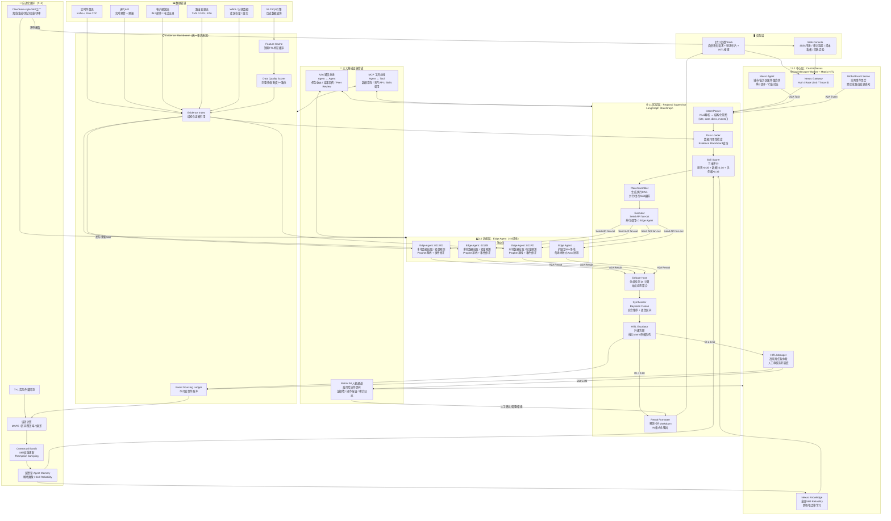
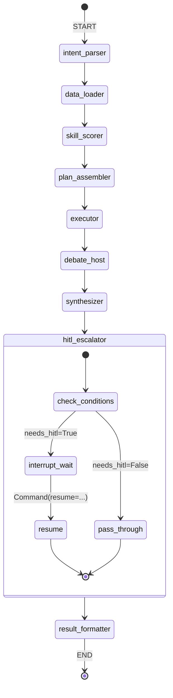

# 第四章：终版行业解决方案核心架构与代码实现

> 本章是报告核心工程实现章节，将前三章的理论推导和框架选型结论落地为可实施的终版架构。包含：Mermaid 完整架构图、多Agent分歧检测与Debate机制、宏观-微观双分辨率融合算法、Platt Scaling统计学校准、LangGraph状态图完整定义、以及Agent间四类标准通信协议报文。

---

## 4.1 终版系统架构图（Mermaid）

基于第3章穷举排除法证明的层级联邦式拓扑（L0边缘 + L1区域 + L2中心）和第2章12维量化矩阵的框架选型结论，终版架构采用 **AgentScope Actor（L0）+ LangGraph StateGraph（L1）+ HiClaw Manager-Worker（L2）** 的三层组合方案，通过A2A通信总线、MCP工具总线和Matrix IM人机通道三大基础设施管道串联。



**架构分层职责表：**

| 层级 | 运行环境 | 核心组件 | 通信协议 | 典型规模 |
|------|---------|---------|---------|---------|
| **L0 边缘层** | AgentScope Actor 独立进程 | Prophet基线 + 事件修正Skill | A2A Result / MCP Tool | N个场地（50→1000+） |
| **L1 区域层** | LangGraph StateGraph | 意图解析→数据加载→Skill评分→执行→辩论→融合→HITL升级 | A2A Task / A2A Result / MCP | 1个/区域 |
| **L2 中心层** | HiClaw Manager-Worker | 宏观趋势 / 全局事件 / HITL仲裁 / 跨区域知识 | A2A / Matrix IM | 1个全局 |
| **基础设施** | 独立服务 | A2A Bus / MCP Bus / Matrix IM | — | 全局共享 |

---

## 4.2 核心机制详细设计

### 4.2.1 多Agent分歧检测与Debate机制

基于第1章 Martingale 定理确立的"投票优于辩论"核心设计法则，物流预测场景的分歧处理采用**分层量化机制**：先检测分歧程度，再按梯度选择协调策略，仅在高分歧场景触发辩论和HITL。

#### 第一步：分歧检测（Divergence Detection）

分歧指数（Divergence Index, DI）定义为各Agent预测值的变异系数：

$$
DI = \frac{\sigma(\{y_1, y_2, ..., y_n\})}{\mu(\{y_1, y_2, ..., y_n\})}
$$

其中 $y_i$ 为 Agent $i$ 的点预测值，$\sigma$ 为标准差，$\mu$ 为均值。

**触发阈值策略**：

| DI 区间 | 协调策略 | 说明 |
|---------|---------|------|
| DI < 0.20 | 直接加权投票聚合 | 分歧可接受，无需额外协调 |
| DI ∈ [0.20, 0.35) | 加权投票聚合（Weighted Majority Voting） | 利用历史可靠性权重自动消解分歧 |
| DI ∈ [0.35, 0.50) | 加权投票 + Peer Review | 各Agent给其他预测值打分，低分离群值降权 |
| DI ≥ 0.50 | 升级至 L2 HITL | 推入 Matrix 人工审核队列 |

**Python 伪代码实现**：

```python
import numpy as np
from dataclasses import dataclass, field
from typing import List, Dict, Optional, Tuple
from enum import Enum


class Strategy(Enum):
    DIRECT_FUSION = "direct_fusion"       # DI < 0.20
    WEIGHTED_VOTING = "weighted_voting"   # DI ∈ [0.20, 0.35)
    PEER_REVIEW = "peer_review"           # DI ∈ [0.35, 0.50)
    HITL_ESCALATE = "hitl_escalate"       # DI ≥ 0.50


@dataclass
class AgentClaim:
    """单个Agent的预测主张"""
    agent_id: str
    skill_id: str
    point_forecast: float          # 点预测值 y_i
    interval_lower: float          # 区间下界 P10
    interval_upper: float          # 区间上界 P90
    confidence: float              # Agent自评置信度 [0, 1]
    historical_mape: float         # 历史30天MAPE
    evidence_refs: List[str] = field(default_factory=list)
    sample_count: int = 30         # 历史样本数（用于可靠性衰减）
    
    @property
    def reliability_weight(self) -> float:
        """基于历史MAPE的可靠性权重"""
        return np.exp(-3.0 * self.historical_mape)


@dataclass
class DivergenceReport:
    """分歧检测报告"""
    di: float                       # 分歧指数
    strategy: Strategy              # 推荐协调策略
    mean_forecast: float            # 均值预测
    std_forecast: float             # 标准差
    avg_interval_overlap: float     # 平均区间重叠率
    outlier_agents: List[str]       # 离群Agent列表
    needs_hitl: bool                # 是否需要HITL


class DivergenceDetector:
    """
    分歧检测器：计算DI、评估区间重叠、识别离群值
    """
    
    @staticmethod
    def compute_di(claims: List[AgentClaim]) -> float:
        """计算分歧指数 DI = σ / μ"""
        forecasts = np.array([c.point_forecast for c in claims])
        mu = np.mean(forecasts)
        sigma = np.std(forecasts)
        if mu == 0:
            return float('inf')
        return sigma / mu
    
    @staticmethod
    def compute_interval_overlap(claims: List[AgentClaim]) -> float:
        """计算平均区间重叠率（两两之间）"""
        n = len(claims)
        if n < 2:
            return 1.0
        overlaps = []
        for i in range(n):
            for j in range(i + 1, n):
                a_low, a_high = claims[i].interval_lower, claims[i].interval_upper
                b_low, b_high = claims[j].interval_lower, claims[j].interval_upper
                overlap_low = max(a_low, b_low)
                overlap_high = min(a_high, b_high)
                if overlap_high > overlap_low:
                    overlap_range = overlap_high - overlap_low
                    total_range = max(a_high, b_high) - min(a_low, b_low)
                    overlaps.append(overlap_range / total_range if total_range > 0 else 0.0)
                else:
                    overlaps.append(0.0)
        return np.mean(overlaps) if overlaps else 0.0
    
    @staticmethod
    def detect_outliers(claims: List[AgentClaim], z_threshold: float = 1.5) -> List[str]:
        """基于Z-score检测离群Agent"""
        forecasts = np.array([c.point_forecast for c in claims])
        mu = np.mean(forecasts)
        sigma = np.std(forecasts)
        if sigma == 0:
            return []
        z_scores = np.abs((forecasts - mu) / sigma)
        return [claims[i].agent_id for i in range(len(claims)) if z_scores[i] > z_threshold]
    
    def analyze(self, claims: List[AgentClaim]) -> DivergenceReport:
        """综合分析分歧程度并推荐策略"""
        di = self.compute_di(claims)
        avg_overlap = self.compute_interval_overlap(claims)
        outliers = self.detect_outliers(claims)
        
        # 策略选择
        if di < 0.20:
            strategy = Strategy.DIRECT_FUSION
            needs_hitl = False
        elif di < 0.35:
            strategy = Strategy.WEIGHTED_VOTING
            needs_hitl = False
        elif di < 0.50:
            strategy = Strategy.PEER_REVIEW
            needs_hitl = False
        else:
            strategy = Strategy.HITL_ESCALATE
            needs_hitl = True
        
        forecasts = np.array([c.point_forecast for c in claims])
        
        return DivergenceReport(
            di=di,
            strategy=strategy,
            mean_forecast=float(np.mean(forecasts)),
            std_forecast=float(np.std(forecasts)),
            avg_interval_overlap=avg_overlap,
            outlier_agents=outliers,
            needs_hitl=needs_hitl,
        )


class VoteAggregator:
    """
    加权投票聚合器：基于Agent历史可靠性进行加权融合
    
    理论基础（第1章 Diversity Bonus 方差不等式）：
    Var(ensemble) = σ²/N + (N-1)/N · ρσ²
    其中 ρ 为Agent间平均相关系数，N为Agent数量
    增加异质性Agent（降低ρ）可降低集成方差
    """
    
    def __init__(self, alpha: float = 3.0):
        """
        Args:
            alpha: MAPE衰减系数，越大则历史表现差异对权重影响越大
        """
        self.alpha = alpha
    
    def compute_weights(self, claims: List[AgentClaim]) -> np.ndarray:
        """
        权重公式: w_i = exp(-α · MAPE_i) / Σ_j exp(-α · MAPE_j)
        
        小样本惩罚: 当sample_count < 30时，额外施加不确定性折扣
        """
        raw_weights = np.array([
            np.exp(-self.alpha * c.historical_mape) for c in claims
        ])
        # 小样本惩罚：sample_count/30 作为可靠性折扣因子
        sample_discounts = np.array([
            min(1.0, c.sample_count / 30.0) for c in claims
        ])
        adjusted = raw_weights * sample_discounts
        return adjusted / adjusted.sum()
    
    def weighted_vote(
        self, claims: List[AgentClaim]
    ) -> Tuple[float, Tuple[float, float]]:
        """
        加权投票聚合
        
        Returns:
            y_hat: 加权点预测
            (ci_lower, ci_upper): Bootstrap置信区间（80%）
        """
        weights = self.compute_weights(claims)
        forecasts = np.array([c.point_forecast for c in claims])
        
        # 加权均值
        y_hat = float(np.dot(weights, forecasts))
        
        # Bootstrap置信区间
        n_bootstrap = 1000
        bootstrap_means = []
        rng = np.random.RandomState(42)
        for _ in range(n_bootstrap):
            idx = rng.choice(len(forecasts), size=len(forecasts), replace=True)
            bootstrap_means.append(np.average(forecasts[idx], weights=weights[idx]))
        
        ci_lower = float(np.percentile(bootstrap_means, 10))
        ci_upper = float(np.percentile(bootstrap_means, 90))
        
        return y_hat, (ci_lower, ci_upper)
    
    def peer_review_adjust(
        self, claims: List[AgentClaim]
    ) -> List[AgentClaim]:
        """
        Peer Review降权：各Agent对其他预测值打分，低分离群值降权
        
        流程：
        1. 每个Agent对除自己外的所有预测值打分（基于证据一致性）
        2. 计算每个Agent的平均peer score
        3. 低分Agent的权重乘以折扣因子（最低0.3）
        """
        n = len(claims)
        peer_scores = np.zeros(n)
        
        for i in range(n):
            scores_for_i = []
            for j in range(n):
                if i == j:
                    continue
                # Peer scoring: 基于区间重叠和预测偏差
                overlap_ratio = self._pairwise_overlap(claims[i], claims[j])
                relative_deviation = abs(
                    claims[i].point_forecast - claims[j].point_forecast
                ) / max(abs(claims[j].point_forecast), 1.0)
                # 综合评分：重叠高、偏差小 → 高分
                score = overlap_ratio * (1.0 - min(relative_deviation, 1.0))
                scores_for_i.append(score)
            peer_scores[i] = np.mean(scores_for_i) if scores_for_i else 0.5
        
        # 降权：peer_score低于均值1个标准差的Agent
        mean_score = np.mean(peer_scores)
        std_score = np.std(peer_scores)
        
        adjusted = []
        for i, claim in enumerate(claims):
            if peer_scores[i] < mean_score - std_score and std_score > 0:
                discount = max(0.3, peer_scores[i] / mean_score)
                adjusted.append(AgentClaim(
                    agent_id=claim.agent_id,
                    skill_id=claim.skill_id,
                    point_forecast=claim.point_forecast,
                    interval_lower=claim.interval_lower,
                    interval_upper=claim.interval_upper,
                    confidence=claim.confidence * discount,
                    historical_mape=claim.historical_mape / discount,
                    evidence_refs=claim.evidence_refs,
                    sample_count=claim.sample_count,
                ))
            else:
                adjusted.append(claim)
        
        return adjusted
    
    @staticmethod
    def _pairwise_overlap(a: AgentClaim, b: AgentClaim) -> float:
        """计算两个Agent预测区间的重叠率"""
        a_low, a_high = a.interval_lower, a.interval_upper
        b_low, b_high = b.interval_lower, b.interval_upper
        overlap_low = max(a_low, b_low)
        overlap_high = min(a_high, b_high)
        if overlap_high <= overlap_low:
            return 0.0
        overlap_range = overlap_high - overlap_low
        total_range = max(a_high, b_high) - min(a_low, b_low)
        return overlap_range / total_range if total_range > 0 else 0.0


class HITLEscalator:
    """
    HITL升级器：构造人工审核请求并推入Matrix队列
    """
    
    def should_escalate(
        self, report: DivergenceReport, business_impact: float
    ) -> bool:
        """
        升级判断：
        - DI ≥ 0.50 强制升级
        - business_impact ≥ 0.70 强制升级
        - 任一Agent证据质量为"低"且为离群值 → 升级
        """
        if report.needs_hitl:
            return True
        if business_impact >= 0.70:
            return True
        return False
    
    def build_hitl_payload(
        self,
        claims: List[AgentClaim],
        report: DivergenceReport,
        fused_forecast: float,
        ci: Tuple[float, float],
        trace_id: str,
    ) -> dict:
        """构造推入Matrix的HITL审核卡片"""
        return {
            "msg_type": "forecast.hitl.review",
            "trace_id": trace_id,
            "risk_level": "high" if report.di >= 0.50 else "medium",
            "summary": {
                "fused_forecast": fused_forecast,
                "ci_80": [ci[0], ci[1]],
                "di": round(report.di, 4),
                "agent_count": len(claims),
                "outlier_agents": report.outlier_agents,
            },
            "claims": [
                {
                    "agent_id": c.agent_id,
                    "skill": c.skill_id,
                    "forecast": c.point_forecast,
                    "interval": [c.interval_lower, c.interval_upper],
                    "confidence": c.confidence,
                    "mape": c.historical_mape,
                    "evidence": c.evidence_refs,
                }
                for c in claims
            ],
            "actions": ["confirm", "adjust", "reject", "request_debate"],
            "deadline_minutes": 15,
        }


def debate_orchestrator(claims: List[AgentClaim], trace_id: str) -> dict:
    """
    完整的分歧处理编排器：检测→策略选择→执行
    
    使用示例:
    >>> result = debate_orchestrator(claims, "tr_20260602_001")
    """
    detector = DivergenceDetector()
    aggregator = VoteAggregator(alpha=3.0)
    escalator = HITLEscalator()
    
    # Step 1: 分歧检测
    report = detector.analyze(claims)
    
    # Step 2: 按策略执行
    if report.strategy == Strategy.DIRECT_FUSION:
        y_hat, ci = aggregator.weighted_vote(claims)
        return {
            "trace_id": trace_id,
            "strategy": "direct_fusion",
            "di": report.di,
            "forecast": y_hat,
            "ci_80": ci,
            "needs_hitl": False,
        }
    
    elif report.strategy == Strategy.WEIGHTED_VOTING:
        y_hat, ci = aggregator.weighted_vote(claims)
        return {
            "trace_id": trace_id,
            "strategy": "weighted_voting",
            "di": report.di,
            "forecast": y_hat,
            "ci_80": ci,
            "needs_hitl": False,
        }
    
    elif report.strategy == Strategy.PEER_REVIEW:
        adjusted = aggregator.peer_review_adjust(claims)
        y_hat, ci = aggregator.weighted_vote(adjusted)
        needs_hitl = escalator.should_escalate(report, business_impact=0.5)
        return {
            "trace_id": trace_id,
            "strategy": "peer_review",
            "di": report.di,
            "forecast": y_hat,
            "ci_80": ci,
            "needs_hitl": needs_hitl,
        }
    
    else:  # HITL_ESCALATE
        y_hat, ci = aggregator.weighted_vote(claims)
        hitl_payload = escalator.build_hitl_payload(
            claims, report, y_hat, ci, trace_id
        )
        return {
            "trace_id": trace_id,
            "strategy": "hitl_escalate",
            "di": report.di,
            "forecast": y_hat,
            "ci_80": ci,
            "needs_hitl": True,
            "hitl_payload": hitl_payload,
        }
```

**关键设计决策**：
- DI 阈值 0.20 / 0.35 / 0.50 基于物流件量预测的历史经验标定，可通过回放数据调优
- Peer Review 机制不是开放对话，而是基于区间重叠率和预测偏差的结构化评分，避免第1章指出的"辩论从众"陷阱
- 小样本Agent（<30次历史记录）自动降权，防止新上线的Skill污染融合结果

---

#### 第二步：协调策略分梯度执行（见上述代码中的 `debate_orchestrator`）

#### 第三步：加权投票聚合的数学基础

根据第1章 Diversity Bonus 方差不等式：

$$
Var(ensemble) = \frac{\sigma^2}{N} + \frac{N-1}{N} \cdot \rho\sigma^2
$$

其中 $N$ 为Agent数量，$\rho$ 为Agent间平均相关系数。该公式揭示了两个降低集成方差的关键路径：
1. **增加N**：但边际收益递减，且Token成本线性增长（这也是为何物流预测L1-L2场景仅需2-3个Agent）
2. **降低ρ**：通过选择异质性Agent（不同Skill类型、不同数据源），这是本文推荐的核心策略

权重公式基于 Agent 历史 MAPE 的指数衰减：

$$
w_i = \frac{\exp(-\alpha \cdot MAPE_i)}{\sum_j \exp(-\alpha \cdot MAPE_j)}
$$

其中 $\alpha = 3.0$ 为衰减系数，使得 MAPE=5% 的Agent权重约为 MAPE=15% 的Agent的 1.35 倍（$\exp(-0.15)/\exp(-0.45) \approx 1.35$），避免权重过度集中。

最终加权预测：

$$
\hat{y} = \sum_i w_i \cdot y_i
$$

置信区间采用 Bootstrap（1000次重采样）计算 P10-P90 区间，而非假设正态分布，以处理Agent预测分布可能的偏态。

---

### 4.2.2 宏观趋势与微观事件的融合算法（Nexus双分辨率）

基于第3章推导的层级架构，L2中心层负责宏观趋势分析，L0边缘层负责微观事件感知，两者通过双向融合机制协同。

**融合公式**：

$$
\hat{y}_{final} = (y_{baseline} + \Delta_{micro}) \times c_{macro}
$$

其中：
- $y_{baseline}$：时序基线预测（Prophet/Chronos输出）
- $\Delta_{micro}$：L0层微观事件修正值（天气/客户/倒货/修路等事件Delta的加权和）
- $c_{macro}$：L2层宏观趋势修正系数（季节因子/行业动态/全网增长率）

**宏微观融合判断矩阵**：

| Macro状态 | Micro状态 | 判定 | 融合策略 | 示例场景 |
|-----------|----------|------|---------|---------|
| 正常 | 正常 | 常规场景 | $\hat{y} = y_{baseline} \times c_{macro}$ | 日常平稳预测 |
| 正常 | 异常 | **采纳Micro警示** | $\hat{y} = (y_{baseline} + \Delta_{micro}) \times c_{macro}$ | 局部暴雨/客户包机，区域整体正常 |
| 异常 | 正常 | **采纳Macro趋势** | $\hat{y} = y_{baseline} \times c_{macro}$ | 全网促销/节假日，本场地无特殊事件 |
| 异常 | 皆异常 | **HITL升级** | 推入Matrix人工审核 | 大促+局部暴雨+客户包机叠加 |

**Python伪代码实现**：

```python
from dataclasses import dataclass
from enum import Enum


class Status(Enum):
    NORMAL = "normal"
    ABNORMAL = "abnormal"


@dataclass
class MacroSignal:
    """L2层宏观信号"""
    trend_coefficient: float      # c_macro，如1.05表示比基准高5%
    season_factor: float          # 季节因子
    industry_growth: float        # 行业增长率
    is_abnormal: bool             # 是否被判定为异常
    confidence: float             # 宏观信号置信度
    evidence: List[str]


@dataclass
class MicroDelta:
    """L0层微观修正"""
    total_delta: float            # Δ_micro，所有事件Delta的加权和
    event_details: List[dict]     # 各事件明细
    is_abnormal: bool             # 是否被判定为异常
    confidence: float             # 微观修正置信度


def classify_status(value: float, threshold: float, baseline: float) -> Status:
    """基于偏离比例判定正常/异常"""
    deviation = abs(value - baseline) / max(abs(baseline), 1.0)
    return Status.ABNORMAL if deviation > threshold else Status.NORMAL


def macro_micro_fusion(
    baseline: float,
    macro: MacroSignal,
    micro: MicroDelta,
    trace_id: str,
) -> dict:
    """
    宏微观双分辨率融合算法
    
    Returns:
        {
            "forecast": final_forecast,
            "fusion_path": "micro" | "macro" | "both" | "hitl",
            "explanation": str,
        }
    """
    macro_status = classify_status(
        macro.trend_coefficient, threshold=0.08, baseline=1.0
    )
    micro_status = classify_status(
        micro.total_delta, threshold=0.10, baseline=baseline
    )
    
    # 判断矩阵
    if macro_status == Status.NORMAL and micro_status == Status.NORMAL:
        # 皆正常：Macro主导
        final = baseline * macro.trend_coefficient
        return {
            "forecast": final,
            "fusion_path": "macro_only",
            "explanation": f"常规场景，宏观系数{macro.trend_coefficient:.3f}主导",
            "needs_hitl": False,
        }
    
    elif macro_status == Status.NORMAL and micro_status == Status.ABNORMAL:
        # Micro异常：采纳Micro警示（局部真实异常）
        final = (baseline + micro.total_delta) * macro.trend_coefficient
        return {
            "forecast": final,
            "fusion_path": "micro_dominant",
            "explanation": f"局部事件异常(Δ={micro.total_delta:+.0f})，采纳微观修正",
            "needs_hitl": False,
        }
    
    elif macro_status == Status.ABNORMAL and micro_status == Status.NORMAL:
        # Macro异常：采纳Macro趋势（全场站被宏观因素影响）
        final = baseline * macro.trend_coefficient
        return {
            "forecast": final,
            "fusion_path": "macro_dominant",
            "explanation": f"宏观趋势异常(c={macro.trend_coefficient:.3f})，采纳宏观系数",
            "needs_hitl": False,
        }
    
    else:  # 两者皆异常 → HITL
        # 生成两个备选方案供人工选择
        option_micro = (baseline + micro.total_delta) * macro.trend_coefficient
        option_macro = baseline * macro.trend_coefficient
        return {
            "forecast": option_micro,  # 默认给Micro主导方案
            "options": {
                "micro_dominant": option_micro,
                "macro_dominant": option_macro,
                "baseline_only": baseline,
            },
            "fusion_path": "hitl",
            "explanation": (
                f"宏微观双重异常：宏观系数{macro.trend_coefficient:.3f}，"
                f"微观Δ={micro.total_delta:+.0f}，升级人工审核"
            ),
            "needs_hitl": True,
            "macro_evidence": macro.evidence,
            "micro_events": micro.event_details,
        }
```

**关键设计考量**：
- Macro正常/异常阈值 0.08（即趋势系数偏离8%以上视为异常），Micro阈值 0.10（事件修正量超过基线10%视为异常），两者不对称是因为宏观信号通常更平滑
- 两者皆异常时生成两个备选方案，同时推入Matrix人工审核队列，由场地主管选择

---

### 4.2.3 统计学校准机制（Platt Scaling扩展）

LLM/Agent综合推荐存在"向均值回归"的保守倾向——高估低谷、低估峰值。传统Platt Scaling面向二分类概率校准，本文将其扩展至回归预测的置信度校准。

**核心思想**：通过历史30天误差分布拟合校准函数，将Agent自评的原始置信度 $c_{raw}$ 映射为经验校准后的置信度 $c_{calibrated}$。

**校准函数**（扩展Platt Scaling）：

$$
c_{calibrated} = \frac{1}{1 + \exp(A \cdot e_{normalized} + B)}
$$

其中 $e_{normalized} = |y_{pred} - y_{actual}| / y_{actual}$ 为归一化绝对误差，$A$ 和 $B$ 通过历史30天的误差分布进行Logistic回归拟合。

**校准时机**：
- 每30天定期校准
- MAD（Mean Absolute Deviation）漂移 > 0.05时触发紧急校准

**Python完整实现**：

```python
import numpy as np
from scipy.optimize import minimize
from dataclasses import dataclass, field
from typing import List, Tuple


@dataclass
class CalibrationRecord:
    """单条校准记录"""
    predicted: float
    actual: float
    raw_confidence: float
    timestamp: str
    site_code: str
    dimension: str


@dataclass
class PlattCalibrator:
    """
    扩展Platt Scaling：回归预测的置信度校准
    
    与传统二分类Platt Scaling的区别：
    - 二分类：P(y=1|x) = 1/(1+exp(A·f(x)+B))，f(x)为SVM输出分数
    - 本扩展：c_cal = 1/(1+exp(A·e_norm+B))，e_norm为归一化误差
    """
    
    A: float = 0.0       # 斜率参数
    B: float = 0.0       # 截距参数
    fitted: bool = False
    last_fit_date: str = ""
    _history: List[CalibrationRecord] = field(default_factory=list)
    
    def add_record(self, record: CalibrationRecord):
        """追加校准记录（最多保留90天）"""
        self._history.append(record)
        if len(self._history) > 90 * 10:  # 假设每天最多10条
            self._history = self._history[-90 * 10:]
    
    def _compute_normalized_error(self, record: CalibrationRecord) -> float:
        """计算归一化绝对误差"""
        if record.actual == 0:
            return 1.0 if record.predicted != 0 else 0.0
        return abs(record.predicted - record.actual) / abs(record.actual)
    
    def fit(self, window_days: int = 30) -> Tuple[float, float]:
        """
        使用最近window_days的记录拟合A/B参数
        
        目标：最小化校准置信度与实际误差经验分布之间的KL散度
        等效于Logistic回归的负对数似然
        
        损失函数：
        L(A,B) = -Σ [t_i · log(p_i) + (1-t_i) · log(1-p_i)]
        其中 t_i = 1 if e_norm_i < threshold else 0
              p_i = 1/(1+exp(A·e_norm_i + B))
        """
        if len(self._history) < 10:
            return self.A, self.B  # 样本不足，保持原参数
        
        errors = np.array([self._compute_normalized_error(r) for r in self._history])
        confidences = np.array([r.raw_confidence for r in self._history])
        
        # 经验"好预测"标签：误差低于Agent自评的1-置信度范围
        # 即 e_norm < (1 - confidence) 视为Agent准确
        labels = (errors < (1.0 - confidences)).astype(float)
        
        def neg_log_likelihood(params):
            A, B = params
            logits = A * errors + B
            # 数值稳定性
            logits = np.clip(logits, -50, 50)
            p = 1.0 / (1.0 + np.exp(logits))
            # Binary cross-entropy
            eps = 1e-12
            loss = -np.mean(labels * np.log(p + eps) + (1 - labels) * np.log(1 - p + eps))
            return loss
        
        result = minimize(neg_log_likelihood, x0=[self.A, self.B], method='Nelder-Mead')
        self.A, self.B = result.x
        self.fitted = True
        
        return self.A, self.B
    
    def calibrate(self, raw_confidence: float, predicted: float, 
                  expected_error: float = None) -> float:
        """
        校准单个置信度
        
        Args:
            raw_confidence: Agent原始自评置信度 [0, 1]
            predicted: 预测值
            expected_error: 预期归一化误差（如不可得，用历史均值）
        
        Returns:
            校准后置信度 [0, 1]
        """
        if not self.fitted:
            # 未拟合时使用简单启发式：置信度打8折作为保守估计
            return raw_confidence * 0.8
        
        if expected_error is None:
            # 使用历史平均归一化误差
            if self._history:
                expected_error = np.mean([
                    self._compute_normalized_error(r) for r in self._history[-30:]
                ])
            else:
                expected_error = 1.0 - raw_confidence
        
        logit = self.A * expected_error + self.B
        logit = np.clip(logit, -50, 50)
        calibrated = 1.0 / (1.0 + np.exp(logit))
        
        # 边界约束：校准后置信度不能超过原始值太多
        return min(calibrated, raw_confidence * 1.2)
    
    def should_recalibrate(self, recent_errors: List[float], 
                           drift_threshold: float = 0.05) -> bool:
        """
        检查是否需要重新校准
        
        条件1：距上次校准超过30天
        条件2：最近MAD漂移超过阈值
        """
        if not self._history:
            return True
        
        if recent_errors:
            recent_mad = np.median(np.abs(recent_errors))
            historical_mad = np.median([
                self._compute_normalized_error(r) for r in self._history[-30:]
            ])
            mad_drift = abs(recent_mad - historical_mad)
            if mad_drift > drift_threshold:
                return True
        
        return False
    
    def calibrate_interval(
        self,
        point: float,
        interval: Tuple[float, float],
        raw_confidence: float,
    ) -> Tuple[float, Tuple[float, float]]:
        """
        校准预测区间：根据校准后的置信度缩放区间宽度
        
        如果校准后发现Agent系统性过度自信（c_cal < c_raw），
        则按比例扩宽区间；反之保持或微调。
        """
        calibrated_conf = self.calibrate(raw_confidence, point)
        
        if calibrated_conf < raw_confidence:
            # 扩宽区间：缩放因子 = (1-c_raw) / (1-c_cal)
            width_ratio = (1.0 - raw_confidence) / max(1.0 - calibrated_conf, 0.01)
            width_ratio = min(width_ratio, 3.0)  # 最多扩宽3倍
            
            center = (interval[0] + interval[1]) / 2.0
            half_width = (interval[1] - interval[0]) / 2.0
            new_half = half_width * width_ratio
            return calibrated_conf, (center - new_half, center + new_half)
        
        return calibrated_conf, interval


# ========================
# 使用示例
# ========================
def calibrate_forecast_example():
    calibrator = PlattCalibrator()
    
    # 模拟历史30天记录
    for i in range(30):
        calibrator.add_record(CalibrationRecord(
            predicted=100000 + np.random.normal(0, 5000),
            actual=100000 + np.random.normal(0, 8000),
            raw_confidence=0.75 + np.random.normal(0, 0.05),
            timestamp=f"2026-05-{(i+1):02d}",
            site_code="021WD",
            dimension="site_total",
        ))
    
    # 拟合
    A, B = calibrator.fit(window_days=30)
    print(f"Fitted: A={A:.4f}, B={B:.4f}")
    
    # 校准新预测
    raw_conf = 0.80
    point = 105000
    interval = (98000, 112000)
    
    cal_conf, cal_interval = calibrator.calibrate_interval(point, interval, raw_conf)
    print(f"Raw conf: {raw_conf:.2f} → Calibrated: {cal_conf:.2f}")
    print(f"Raw interval: {interval} → Calibrated: {cal_interval}")
```

---

## 4.3 LangGraph 状态图定义（Region Supervisor 状态机）

L1层 Regional Supervisor 是本系统的核心编排引擎，基于 LangGraph StateGraph 实现完整的状态机。以下给出可直接使用的完整定义。

```python
"""
L1 Regional Supervisor — LangGraph StateGraph 完整定义

依赖: pip install langgraph langgraph-checkpoint
Python ≥ 3.10
"""

from typing import TypedDict, List, Optional, Literal, Annotated, Any
from dataclasses import dataclass, field
import operator
import uuid

from langgraph.graph import StateGraph, START, END
from langgraph.graph.state import CompiledStateGraph
from langgraph.types import Command, interrupt, Send
from langgraph.checkpoint.memory import MemorySaver
# 生产环境推荐: from langgraph.checkpoint.sqlite import SqliteSaver


# ========================
# 1. State 定义 (TypedDict)
# ========================

class EvidenceItem(TypedDict):
    evidence_id: str
    type: str           # "weather" | "customer" | "route" | "volume" | "human_note"
    source: str
    summary: str
    quality_score: float  # [0, 1]


class SkillPlan(TypedDict):
    skill_id: str
    skill_name: str
    scene_score: float     # 场景匹配度 × 0.35
    data_score: float      # 数据可用性 × 0.30
    priority_score: float  # 业务优先级 × 0.35
    total_score: float
    assigned_agent: str    # L0 Edge Agent ID
    arguments: dict


class AgentResult(TypedDict):
    agent_id: str
    skill_id: str
    point_forecast: float
    interval_lower: float
    interval_upper: float
    confidence: float
    historical_mape: float
    evidence_refs: List[str]
    runtime_ms: int
    token_cost: float


class ForecastState(TypedDict):
    """L1 Supervisor 完整状态"""
    # 请求溯源
    trace_id: str
    request_raw: str           # 原始自然语言请求
    user_id: str
    
    # 意图解析输出
    intent: dict               # {site, date, dims, events[], horizon}
    intent_confidence: float
    
    # 数据加载输出
    evidence: List[EvidenceItem]
    data_completeness: float   # [0, 1]
    data_quality_warnings: List[str]
    
    # Skill评分输出
    skill_plans: List[SkillPlan]
    execution_dag: dict        # 执行DAG: {parallel_groups: [[skill_ids], ...]}
    
    # 执行结果
    agent_results: Annotated[List[AgentResult], operator.add]  # Reducer: 追加而非覆盖
    execution_errors: List[dict]
    
    # Debate输出
    divergence_index: float
    debate_strategy: str       # "direct_fusion" | "weighted_voting" | "peer_review" | "hitl_escalate"
    debate_rounds: int
    
    # 融合输出
    fused_forecast: Optional[float]
    confidence_interval: Optional[tuple]
    calibrated_confidence: Optional[float]
    
    # HITL
    hitl_required: bool
    hitl_payload: Optional[dict]
    hitl_response: Optional[dict]    # 人工响应
    
    # 最终输出
    final_forecast: Optional[float]
    final_interval: Optional[tuple]
    formatted_card: Optional[str]    # Markdown卡片


# ========================
# 2. Node 函数定义
# ========================

def node_intent_parser(state: ForecastState) -> dict:
    """
    解析用户自然语言请求 → 提取结构化意图
    
    输入：state["request_raw"]（如"预测明天金山到件量，考虑得物直播和暴雨"）
    输出：{site_code, target_date, dimensions, events[], horizon}
    """
    # 实际实现中调用LLM进行NLU解析
    # 此处展示核心逻辑
    raw = state["request_raw"]
    trace_id = state["trace_id"]
    
    # 模拟解析逻辑（生产环境使用LLM + 实体抽取）
    intent = {
        "site_code": "021WD",          # 从"金山"映射
        "target_date": "2026-06-03",   # 从"明天"计算
        "dimensions": ["site_total", "shift"],
        "events": ["customer_live", "rainstorm"],  # "得物直播"+"暴雨"
        "horizon": "T+1",
        "raw_text": raw,
    }
    
    return {
        "intent": intent,
        "intent_confidence": 0.92,
    }


def node_data_loader(state: ForecastState) -> dict:
    """
    检查数据可用性，从Evidence Blackboard拉取相关证据
    
    输出：evidence[], data_completeness, data_quality_warnings[]
    """
    intent = state["intent"]
    site = intent.get("site_code", "")
    events = intent.get("events", [])
    
    evidence: List[EvidenceItem] = []
    warnings: List[str] = []
    
    # 1. 查询历史件量（必须）
    evidence.append({
        "evidence_id": f"evd_volume_{site}_30d",
        "type": "volume",
        "source": "nl2sql",
        "summary": f"{site}最近30天日均件量趋势",
        "quality_score": 0.95,
    })
    
    # 2. 查询天气（如有天气事件）
    if "rainstorm" in events:
        evidence.append({
            "evidence_id": f"evd_weather_{site}_20260603",
            "type": "weather",
            "source": "weather_api",
            "summary": "上海金山暴雨橙色预警，预计晚间降雨强度较高",
            "quality_score": 0.90,
        })
    
    # 3. 查询客户通知（如有客户事件）
    if "customer_live" in events:
        evidence.append({
            "evidence_id": f"evd_customer_dewu_20260602",
            "type": "customer",
            "source": "im_notice",
            "summary": "得物客户直播出货通知，预计件量增加",
            "quality_score": 0.65,  # 客户自报可信度中等
        })
        warnings.append("客户通知证据质量为中等(0.65)，建议交叉验证")
    
    completeness = min(1.0, len(evidence) / max(len(events) + 1, 1))
    
    return {
        "evidence": evidence,
        "data_completeness": completeness,
        "data_quality_warnings": warnings,
    }


def node_skill_scorer(state: ForecastState) -> dict:
    """
    三维评分选择最优Skill组合
    
    评分公式：total = scene×0.35 + data×0.30 + priority×0.35
    """
    intent = state["intent"]
    evidence = state["evidence"]
    completeness = state["data_completeness"]
    events = intent.get("events", [])
    
    # 模拟Skill Registry中的候选Skill
    available_skills = [
        {"skill_id": "prophet_baseline_v2", "name": "时序基线",
         "scene_tags": ["*"], "data_requires": ["volume_history"]},
        {"skill_id": "weather_delta_v2", "name": "暴雨影响修正",
         "scene_tags": ["rainstorm", "typhoon"], "data_requires": ["weather_alert"]},
        {"skill_id": "customer_event_v1", "name": "大客户事件",
         "scene_tags": ["customer_live", "customer_promo"], "data_requires": ["customer_notice"]},
        {"skill_id": "capacity_constraint_v3", "name": "运力容量约束",
         "scene_tags": ["route_change", "vehicle_delay"], "data_requires": ["eta_data"]},
    ]
    
    plans: List[SkillPlan] = []
    
    for skill in available_skills:
        # Scene Score: 事件标签匹配度
        scene_match = 1.0 if "*" in skill["scene_tags"] or any(
            e in skill["scene_tags"] for e in events
        ) else 0.3
        
        # Data Score: 所需数据可用性
        evidence_types = {e["type"] for e in evidence}
        required = set(skill["data_requires"])
        data_score = len(required & evidence_types) / max(len(required), 1) * completeness
        
        # Priority Score: 基线模型优先级最高
        priority_score = 0.95 if "baseline" in skill["skill_id"] else 0.70
        
        total = scene_match * 0.35 + data_score * 0.30 + priority_score * 0.35
        
        if total > 0.40:  # 最低阈值
            plans.append({
                "skill_id": skill["skill_id"],
                "skill_name": skill["name"],
                "scene_score": scene_match,
                "data_score": data_score,
                "priority_score": priority_score,
                "total_score": total,
                "assigned_agent": f"edge_{intent['site_code']}",
                "arguments": {
                    "site_code": intent["site_code"],
                    "target_date": intent["target_date"],
                    "dimensions": intent["dimensions"],
                    "events": events,
                },
            })
    
    # 按总分降序排列
    plans.sort(key=lambda p: p["total_score"], reverse=True)
    
    return {"skill_plans": plans[:5]}  # 最多5个Skill


def node_plan_assembler(state: ForecastState) -> dict:
    """
    生成执行DAG：基线→并行事件Skills→融合
    
    DAG结构：
    - Group 0 (串行前置): prophet_baseline_v2
    - Group 1 (并行): [weather_delta_v2, customer_event_v1, capacity_constraint_v3]
    - Group 2 (融合): Bayesian Fusion（后续节点处理）
    """
    plans = state["skill_plans"]
    
    baseline_skills = [p for p in plans if "baseline" in p["skill_id"]]
    event_skills = [p for p in plans if "baseline" not in p["skill_id"]]
    
    dag = {
        "parallel_groups": [
            [p["skill_id"] for p in baseline_skills],   # Group 0: 基线
            [p["skill_id"] for p in event_skills],       # Group 1: 事件Skills
        ],
        "serial_order": ["group_0", "group_1_parallel"],
    }
    
    return {"execution_dag": dag}


def node_executor(state: ForecastState) -> dict:
    """
    通过Send API fan-out并行调用L0 Edge Agent执行预测
    
    使用LangGraph的Send机制实现动态并行fan-out
    """
    plans = state["skill_plans"]
    
    # 实际实现中使用 Send API fan-out:
    # sends = []
    # for plan in plans:
    #     sends.append(Send("execute_skill", {"plan": plan, "evidence": state["evidence"]}))
    # return sends  # LangGraph自动并行执行
    
    # 此处模拟L0 Edge Agent返回结果
    timestamp = state["trace_id"]
    site = state["intent"]["site_code"]
    
    mock_results: List[AgentResult] = [
        {
            "agent_id": f"edge_{site}",
            "skill_id": "prophet_baseline_v2",
            "point_forecast": 920000,
            "interval_lower": 880000,
            "interval_upper": 960000,
            "confidence": 0.85,
            "historical_mape": 0.06,
            "evidence_refs": [f"evd_volume_{site}_30d"],
            "runtime_ms": 1200,
            "token_cost": 0.01,
        },
        {
            "agent_id": f"edge_{site}",
            "skill_id": "weather_delta_v2",
            "point_forecast": 888000,   # 暴雨修正-32000
            "interval_lower": 832000,
            "interval_upper": 944000,
            "confidence": 0.71,
            "historical_mape": 0.09,
            "evidence_refs": [f"evd_weather_{site}_20260603"],
            "runtime_ms": 1800,
            "token_cost": 0.02,
        },
        {
            "agent_id": f"edge_{site}",
            "skill_id": "customer_event_v1",
            "point_forecast": 948000,   # 客户出货+28000
            "interval_lower": 900000,
            "interval_upper": 996000,
            "confidence": 0.65,
            "historical_mape": 0.12,
            "evidence_refs": [f"evd_customer_dewu_20260602"],
            "runtime_ms": 900,
            "token_cost": 0.015,
        },
    ]
    
    return {"agent_results": mock_results}


def node_debate_host(state: ForecastState) -> dict:
    """
    分歧检测 + 投票聚合（调用4.2.1中的Debate Orchestrator）
    """
    from chapter4_debate import (
        DivergenceDetector, VoteAggregator, HITLEscalator,
        AgentClaim, Strategy,
    )
    
    # 将AgentResult转换为AgentClaim
    claims = [
        AgentClaim(
            agent_id=r["agent_id"],
            skill_id=r["skill_id"],
            point_forecast=r["point_forecast"],
            interval_lower=r["interval_lower"],
            interval_upper=r["interval_upper"],
            confidence=r["confidence"],
            historical_mape=r["historical_mape"],
            evidence_refs=r["evidence_refs"],
        )
        for r in state["agent_results"]
    ]
    
    detector = DivergenceDetector()
    report = detector.analyze(claims)
    
    aggregator = VoteAggregator(alpha=3.0)
    
    if report.strategy == Strategy.PEER_REVIEW:
        claims = aggregator.peer_review_adjust(claims)
    
    y_hat, ci = aggregator.weighted_vote(claims)
    
    return {
        "divergence_index": report.di,
        "debate_strategy": report.strategy.value,
        "debate_rounds": 1 if report.strategy == Strategy.PEER_REVIEW else 0,
        "fused_forecast": y_hat,
        "confidence_interval": ci,
    }


def node_synthesizer(state: ForecastState) -> dict:
    """
    综合推荐 + 置信区间 + 校准
    
    此处可集成4.2.2的宏微观融合（如收到L2 Macro Signal）
    和4.2.3的Platt Scaling校准
    """
    y_hat = state.get("fused_forecast", 0)
    ci = state.get("confidence_interval", (0, 0))
    
    # 模拟Platt校准
    calibrated_conf = 0.78  # 生产环境使用PlattCalibrator
    
    return {
        "fused_forecast": y_hat,
        "confidence_interval": ci,
        "calibrated_confidence": calibrated_conf,
    }


def node_hitl_escalator(state: ForecastState) -> dict:
    """
    HITL升级判断：检查是否触发人工介入
    
    使用LangGraph的interrupt()实现人机交互暂停点
    
    升级条件：
    1. DI ≥ 0.50 → 强制升级
    2. 数据完整性 < 0.50 → 升级
    3. 任意Skill置信度 < 0.50 → 升级
    4. 业务影响评估高 → 升级
    """
    di = state.get("divergence_index", 0.0)
    completeness = state.get("data_completeness", 1.0)
    results = state.get("agent_results", [])
    
    low_confidence = any(r["confidence"] < 0.50 for r in results)
    needs_hitl = (
        di >= 0.50
        or completeness < 0.50
        or low_confidence
    )
    
    if needs_hitl:
        # ==== HITL暂停点：等待人工确认 ====
        hitl_card = {
            "msg_type": "forecast.hitl.review",
            "trace_id": state["trace_id"],
            "site": state["intent"]["site_code"],
            "date": state["intent"]["target_date"],
            "forecast": state["fused_forecast"],
            "interval": list(state["confidence_interval"]),
            "di": round(di, 4),
            "data_completeness": completeness,
            "claims_summary": [
                {
                    "skill": r["skill_id"],
                    "forecast": r["point_forecast"],
                    "confidence": r["confidence"],
                    "evidence": r["evidence_refs"],
                }
                for r in results
            ],
            "actions": [
                {"id": "confirm", "label": "✅ 确认采用", "style": "primary"},
                {"id": "adjust", "label": "✏️ 调整数值", "style": "default"},
                {"id": "reject", "label": "❌ 拒绝并重算", "style": "danger"},
                {"id": "detail", "label": "📋 查看证据详情", "style": "default"},
            ],
            "deadline_minutes": 15,
        }
        
        # LangGraph interrupt() 暂停执行，等待人工响应
        response = interrupt(hitl_card)
        
        return {
            "hitl_required": True,
            "hitl_payload": hitl_card,
            "hitl_response": response,  # 人工响应的值
            "final_forecast": response.get("adjusted_forecast", state["fused_forecast"]),
        }
    
    return {
        "hitl_required": False,
        "hitl_payload": None,
        "final_forecast": state["fused_forecast"],
    }


def node_result_formatter(state: ForecastState) -> dict:
    """
    格式化输出卡片（Markdown/JSON混合格式，适配钉钉/企微）
    """
    trace_id = state["trace_id"]
    intent = state["intent"]
    forecast = state.get("final_forecast") or state.get("fused_forecast")
    ci = state.get("confidence_interval")
    di = state.get("divergence_index", 0)
    strategy = state.get("debate_strategy", "unknown")
    results = state.get("agent_results", [])
    evidence = state.get("evidence", [])
    warnings = state.get("data_quality_warnings", [])
    
    di_level = "🟢 低" if di < 0.20 else ("🟡 中" if di < 0.35 else ("🟠 较高" if di < 0.50 else "🔴 高"))
    
    card = f"""## 📊 预测结果 | {intent['site_code']} | {intent['target_date']}

| 指标 | 数值 |
|------|------|
| **综合预测** | **{forecast:,.0f}** 件 |
| **80%置信区间** | [{ci[0]:,.0f}, {ci[1]:,.0f}] |
| **分歧指数** | {di:.3f} ({di_level}) |
| **协调策略** | {strategy} |
| **参与Agent** | {len(results)}个 |

### 🔍 Agent主张明细
| Skill | 预测值 | 置信度 | 历史MAPE |
|-------|--------|--------|----------|
"""
    for r in results:
        card += f"| {r['skill_id']} | {r['point_forecast']:,.0f} | {r['confidence']:.0%} | {r['historical_mape']:.1%} |\n"
    
    if warnings:
        card += f"\n### ⚠️ 数据质量提醒\n"
        for w in warnings:
            card += f"- {w}\n"
    
    card += f"\n> trace_id: `{trace_id}` | 策略: {strategy} | 证据数: {len(evidence)}"
    
    return {"formatted_card": card}


# ========================
# 3. StateGraph 组装
# ========================

def build_regional_supervisor_graph() -> CompiledStateGraph:
    """
    构建L1 Regional Supervisor完整状态图
    """
    graph = StateGraph(ForecastState)
    
    # 注册所有节点
    graph.add_node("intent_parser", node_intent_parser)
    graph.add_node("data_loader", node_data_loader)
    graph.add_node("skill_scorer", node_skill_scorer)
    graph.add_node("plan_assembler", node_plan_assembler)
    graph.add_node("executor", node_executor)
    graph.add_node("debate_host", node_debate_host)
    graph.add_node("synthesizer", node_synthesizer)
    graph.add_node("hitl_escalator", node_hitl_escalator)
    graph.add_node("result_formatter", node_result_formatter)
    
    # 主流程边
    graph.add_edge(START, "intent_parser")
    graph.add_edge("intent_parser", "data_loader")
    graph.add_edge("data_loader", "skill_scorer")
    graph.add_edge("skill_scorer", "plan_assembler")
    graph.add_edge("plan_assembler", "executor")
    graph.add_edge("executor", "debate_host")
    graph.add_edge("debate_host", "synthesizer")
    graph.add_edge("synthesizer", "hitl_escalator")
    
    # 条件边：HITL → Result Formatter
    # hitl_escalator内部使用interrupt()自动暂停
    graph.add_edge("hitl_escalator", "result_formatter")
    graph.add_edge("result_formatter", END)
    
    # 编译（带Checkpointer支持HITL暂停/恢复）
    checkpointer = MemorySaver()  # 开发环境
    # checkpointer = SqliteSaver.from_conn_string("checkpoints.db")  # 生产环境
    
    compiled = graph.compile(
        checkpointer=checkpointer,
        # interrupt_before=["hitl_escalator"],  # 可选：在每个HITL节点前强制暂停
    )
    
    return compiled


# ========================
# 4. 调用示例
# ========================

def run_forecast_example():
    """
    完整的预测执行示例（含HITL恢复流程）
    """
    graph = build_regional_supervisor_graph()
    
    config = {
        "configurable": {
            "thread_id": f"forecast_{uuid.uuid4().hex[:12]}",
        }
    }
    
    initial_state = {
        "trace_id": f"tr_{uuid.uuid4().hex[:8]}",
        "request_raw": "预测明天金山到件量，考虑得物直播和暴雨",
        "user_id": "u_site_manager_021wd",
    }
    
    # 第一轮：执行到HITL暂停点（如果有）
    final_state = None
    stream_input = initial_state
    
    while True:
        stream = graph.stream_events(stream_input, config=config, version="v3")
        
        # 处理流式事件
        for event in stream:
            pass  # 生产环境可以逐token展示
        
        if not stream.interrupted:
            final_state = stream.output
            break
        
        # 图在HITL节点暂停了，需要人工响应
        interrupt_info = stream.interrupts[0].value
        print(f"\n⚠️ HITL Required: {interrupt_info['msg_type']}")
        print(f"   Site: {interrupt_info['site']}, Date: {interrupt_info['date']}")
        print(f"   Forecast: {interrupt_info['forecast']:,.0f}")
        print(f"   DI: {interrupt_info['di']:.4f}")
        
        # 模拟人工响应（生产环境从IM获取）
        human_response = {
            "action": "confirm",
            "adjusted_forecast": interrupt_info["forecast"],
            "comment": "预测合理，确认采用",
        }
        stream_input = Command(resume=human_response)
    
    return final_state


if __name__ == "__main__":
    result = run_forecast_example()
    if result and result.get("formatted_card"):
        print(result["formatted_card"])
```

**状态图可视化（Mermaid）**：



**关键设计说明**：

| 特性 | 实现 | 说明 |
|------|------|------|
| **State持久化** | `MemorySaver` / `SqliteSaver` | 支持HITL暂停后恢复，状态不丢失 |
| **HITL暂停** | `interrupt()` + `Command(resume=...)` | 在高风险节点暂停，等待人工响应后继续 |
| **并行Fan-out** | `Send` API | executor节点可动态fan-out到多个L0 Edge Agent |
| **Reducer** | `operator.add` | agent_results使用追加式Reducer，避免并行结果覆盖 |
| **Thread隔离** | `thread_id` | 每次预测请求独立thread，互不干扰 |
| **条件路由** | `add_conditional_edges` | 可根据DI、数据质量等动态路由 |

---

## 4.4 Agent间 Prompt 传递协议报文

基于A2A协议规范和物流预测场景需求，定义四类标准通信报文。

### 4.4.1 Agent间任务委派报文（A2A Task）

L2 Central Nexus → L1 Regional Supervisor 的任务委派：

```json
{
  "protocol": "a2a.v1",
  "message_type": "task.delegate",
  "message_id": "msg_delegate_20260602_001",
  "timestamp": "2026-06-02T15:30:00+08:00",
  
  "task": {
    "task_id": "task_forecast_021WD_20260603",
    "context_id": "ctx_batch_shanghai_20260602",
    "parent_task_id": "task_nexus_batch_20260602",
    "task_type": "forecast.site.daily",
    
    "intent": {
      "site_code": "021WD",
      "site_name": "上海金山中转场",
      "target_date": "2026-06-03",
      "horizon": "T+1",
      "dimensions": ["site_total", "day_shift", "night_shift"],
      "events": [
        {
          "event_type": "customer_live_streaming",
          "source": "im_notice",
          "customer": "得物",
          "confidence": 0.75,
          "summary": "客户通知6月3日直播出货，预计件量增加"
        },
        {
          "event_type": "weather_rainstorm",
          "source": "weather_api",
          "severity": "orange",
          "confidence": 0.90,
          "summary": "上海金山暴雨橙色预警，影响晚间到车"
        }
      ]
    },
    
    "priority": "high",
    "difficulty_level": "L3",
    "deadline": "2026-06-02T18:00:00+08:00",
    
    "constraints": {
      "max_agents": 5,
      "max_debate_rounds": 1,
      "token_budget": 20000,
      "required_skills": ["prophet_baseline_v2"],
      "optional_skills": ["weather_delta_v2", "customer_event_v1", "capacity_constraint_v3"]
    },
    
    "macro_signals": {
      "trend_coefficient": 1.03,
      "season_factor": 1.08,
      "industry_growth_weekly": 0.02,
      "confidence": 0.82,
      "source": "nexus_macro_agent"
    }
  },
  
  "sender": {
    "agent_id": "nexus_central",
    "agent_type": "central_nexus",
    "layer": "L2"
  },
  
  "recipient": {
    "agent_id": "supervisor_shanghai",
    "agent_type": "regional_supervisor",
    "layer": "L1",
    "region": "shanghai"
  },
  
  "trace": {
    "trace_id": "tr_20260602_batch_sh_001",
    "span_id": "span_delegate_021WD",
    "parent_span_id": "span_nexus_batch"
  }
}
```

### 4.4.2 Agent间结果回传报文（A2A Result）

L1 Regional Supervisor → L2 Central Nexus 的预测结果回传：

```json
{
  "protocol": "a2a.v1",
  "message_type": "result.forecast",
  "message_id": "msg_result_20260602_002",
  "timestamp": "2026-06-02T15:35:42+08:00",
  
  "task_ref": {
    "task_id": "task_forecast_021WD_20260603",
    "context_id": "ctx_batch_shanghai_20260602",
    "parent_task_id": "task_nexus_batch_20260602"
  },
  
  "result": {
    "forecast": {
      "site_code": "021WD",
      "target_date": "2026-06-03",
      "final_forecast": 907500,
      "confidence_interval_80": [868000, 947000],
      "calibrated_confidence": 0.78,
      "dimension_breakdown": {
        "site_total": 907500,
        "day_shift": 462000,
        "night_shift": 445500
      }
    },
    
    "predictions": [
      {
        "agent_id": "edge_021WD",
        "skill_id": "prophet_baseline_v2",
        "skill_version": "2.1.0",
        "point_forecast": 920000,
        "interval": [880000, 960000],
        "confidence": 0.85,
        "weight": 0.38,
        "evidence_refs": ["evd_volume_021WD_30d"],
        "runtime_ms": 1200,
        "token_cost": 0.01
      },
      {
        "agent_id": "edge_021WD",
        "skill_id": "weather_delta_v2",
        "skill_version": "2.1.0",
        "point_forecast": 888000,
        "interval": [832000, 944000],
        "confidence": 0.71,
        "weight": 0.32,
        "evidence_refs": ["evd_weather_20260602_001"],
        "runtime_ms": 1800,
        "token_cost": 0.02
      },
      {
        "agent_id": "edge_021WD",
        "skill_id": "customer_event_v1",
        "skill_version": "1.0.0",
        "point_forecast": 948000,
        "interval": [900000, 996000],
        "confidence": 0.65,
        "weight": 0.30,
        "evidence_refs": ["evd_customer_dewu_20260602"],
        "runtime_ms": 900,
        "token_cost": 0.015
      }
    ],
    
    "divergence_analysis": {
      "divergence_index": 0.31,
      "strategy_used": "weighted_voting",
      "debate_rounds": 0,
      "outlier_agents": [],
      "avg_interval_overlap": 0.72
    },
    
    "execution_stats": {
      "total_runtime_ms": 4200,
      "total_token_cost": 0.045,
      "agent_count": 3,
      "skill_count": 3,
      "evidence_count": 3,
      "data_completeness": 0.85
    },
    
    "quality_flags": {
      "escalate_to_hitl": false,
      "data_quality_warnings": ["customer_notice_confidence_medium"],
      "low_confidence_skills": ["customer_event_v1"],
      "recommendation": "auto_accept"
    },
    
    "agent_trace": [
      {
        "agent_id": "edge_021WD",
        "skill_id": "prophet_baseline_v2",
        "action": "forecast",
        "timestamp": "2026-06-02T15:35:39Z",
        "duration_ms": 1200
      },
      {
        "agent_id": "edge_021WD",
        "skill_id": "weather_delta_v2",
        "action": "forecast",
        "timestamp": "2026-06-02T15:35:40Z",
        "duration_ms": 1800
      },
      {
        "agent_id": "edge_021WD",
        "skill_id": "customer_event_v1",
        "action": "forecast",
        "timestamp": "2026-06-02T15:35:41Z",
        "duration_ms": 900
      }
    ]
  },
  
  "sender": {
    "agent_id": "supervisor_shanghai",
    "agent_type": "regional_supervisor",
    "layer": "L1"
  },
  
  "recipient": {
    "agent_id": "nexus_central",
    "agent_type": "central_nexus",
    "layer": "L2"
  },
  
  "trace": {
    "trace_id": "tr_20260602_batch_sh_001",
    "span_id": "span_result_021WD",
    "parent_span_id": "span_delegate_021WD"
  }
}
```

### 4.4.3 Agent间 Peer Review 报文

多Agent分歧时的结构化互评报文：

```json
{
  "protocol": "a2a.v1",
  "message_type": "peer_review.request",
  "message_id": "msg_review_20260602_003",
  "timestamp": "2026-06-02T15:33:00+08:00",
  
  "review_context": {
    "task_id": "task_forecast_021WD_20260603",
    "trace_id": "tr_20260602_batch_sh_001",
    "review_round": 1,
    "divergence_index": 0.41,
    "review_reason": "DI in [0.35, 0.50), triggering peer review"
  },
  
  "reviewer": {
    "agent_id": "edge_021WD",
    "skill_id": "capacity_constraint_v3",
    "skill_name": "运力容量约束",
    "role": "reviewer"
  },
  
  "targets": [
    {
      "target_agent_id": "edge_021WD",
      "target_skill_id": "customer_event_v1",
      "claim_id": "claim_customer_001",
      "point_forecast": 948000,
      "interval": [900000, 996000],
      "evidence_refs": ["evd_customer_dewu_20260602"],
      "assumptions": ["客户直播出货件量为客户自报×0.85"]
    },
    {
      "target_agent_id": "edge_021WD",
      "target_skill_id": "weather_delta_v2",
      "claim_id": "claim_weather_001",
      "point_forecast": 888000,
      "interval": [832000, 944000],
      "evidence_refs": ["evd_weather_20260602_001"],
      "assumptions": ["暴雨主要造成班次迁移，全天量影响较小"]
    }
  ],
  
  "review_questions": [
    "这些预测值是否违反夜班卸车能力上限？",
    "ETA到车窗口是否支持各Skill的班次分配假设？",
    "客户自报件量是否与历史出货模式一致？"
  ],
  
  "allowed_responses": {
    "verdict_enum": ["support", "challenge", "adjust_interval", "request_human"],
    "must_reference_evidence": true,
    "max_adjustment_ratio": 0.15
  },
  
  "constraints": {
    "max_response_tokens": 500,
    "response_timeout_seconds": 30,
    "forbidden_actions": ["freeform_debate", "unreferenced_guess", "modify_other_claims"]
  },
  
  "trace": {
    "trace_id": "tr_20260602_batch_sh_001",
    "span_id": "span_review_round1"
  }
}
```

**Peer Review 响应报文**：

```json
{
  "protocol": "a2a.v1",
  "message_type": "peer_review.response",
  "message_id": "msg_review_resp_20260602_004",
  "timestamp": "2026-06-02T15:33:12+08:00",
  
  "review_ref": {
    "review_message_id": "msg_review_20260602_003",
    "review_round": 1
  },
  
  "reviewer": {
    "agent_id": "edge_021WD",
    "skill_id": "capacity_constraint_v3"
  },
  
  "reviews": [
    {
      "target_agent_id": "edge_021WD",
      "target_skill_id": "customer_event_v1",
      "target_claim_id": "claim_customer_001",
      "review_score": 0.62,
      "verdict": "adjust_interval",
      "rationale": "22点后ETA集中，夜班吞吐上限不足以处理客户出货的30%件量，建议将部分件量跨班分配",
      "suggested_adjustment": {
        "dimension": "shift",
        "day_shift_delta": -18000,
        "night_shift_delta": 18000,
        "total_unchanged": true
      },
      "evidence_refs": [
        "evd_eta_vehicles_20260603",
        "evd_capacity_night_shift_021WD"
      ],
      "confidence": 0.78
    },
    {
      "target_agent_id": "edge_021WD",
      "target_skill_id": "weather_delta_v2",
      "target_claim_id": "claim_weather_001",
      "review_score": 0.85,
      "verdict": "support",
      "rationale": "暴雨影响晚班到车的假设与ETA数据和历史相似日吻合，全天量影响预判合理",
      "suggested_adjustment": null,
      "evidence_refs": [
        "evd_eta_vehicles_20260603",
        "evd_historical_rainstorm_analogue"
      ],
      "confidence": 0.85
    }
  ],
  
  "summary": {
    "overall_agreement": 0.73,
    "adjustments_count": 1,
    "recommendation": "采纳capacity_constraint_v3的班次调整建议，维持weather_delta_v2原预测"
  },
  
  "trace": {
    "trace_id": "tr_20260602_batch_sh_001",
    "span_id": "span_review_resp_round1"
  }
}
```

### 4.4.4 HITL 人工介入报文（Matrix IM）

推入 Matrix 群聊的 HITL 请求格式化消息：

```json
{
  "protocol": "matrix.im.v1",
  "message_type": "hitl.review_card",
  "message_id": "msg_hitl_20260602_005",
  "timestamp": "2026-06-02T15:36:00+08:00",
  
  "room": {
    "room_id": "!forecast_high_risk_shanghai:matrix.company.com",
    "room_name": "🔴 高风险预测审核-上海区域",
    "mentioned_users": ["@site_manager_021wd", "@regional_manager_shanghai"]
  },
  
  "card": {
    "card_type": "forecast_review",
    "header": {
      "title": "🔴 高风险预测需审核",
      "subtitle": "场地: 021WD 上海金山 | 日期: 2026-06-03",
      "risk_level": "high",
      "risk_reasons": [
        "分歧指数 DI=0.52（超过0.50阈值）",
        "客户通知证据质量低（0.65）",
        "暴雨橙色预警叠加客户直播出货",
        "宏微观双重异常"
      ]
    },
    
    "forecast_section": {
      "title": "📊 系统综合预测",
      "fields": [
        {"label": "综合预测", "value": "907,500 件", "highlight": true},
        {"label": "80%置信区间", "value": "[868,000, 947,000]"},
        {"label": "校准后置信度", "value": "78%"},
        {"label": "日班", "value": "462,000"},
        {"label": "夜班", "value": "445,500"}
      ]
    },
    
    "agent_claims_section": {
      "title": "🤖 Agent主张明细",
      "claims": [
        {
          "skill": "时序基线 (Prophet v2)",
          "forecast": "920,000",
          "maple": "6%",
          "weight": "38%",
          "note": "历史规律稳定"
        },
        {
          "skill": "暴雨影响修正 (Weather v2)",
          "forecast": "888,000",
          "maple": "9%",
          "weight": "32%",
          "note": "预计晚间到车延迟，件量跨班"
        },
        {
          "skill": "大客户事件 (Customer v1)",
          "forecast": "948,000",
          "maple": "12%",
          "weight": "30%",
          "note": "⚠️ 客户自报可信度中等，新Skill样本不足"
        }
      ]
    },
    
    "divergence_section": {
      "title": "📐 分歧分析",
      "fields": [
        {"label": "分歧指数 DI", "value": "0.52"},
        {"label": "策略", "value": "HITL升级（加权投票+Peer Review已尝试）"},
        {"label": "区间重叠率", "value": "63%"},
        {"label": "离群Agent", "value": "customer_event_v1"}
      ]
    },
    
    "evidence_section": {
      "title": "📋 证据清单",
      "evidence_items": [
        {"id": "evd_volume_021WD_30d", "type": "历史件量", "quality": "高(0.95)"},
        {"id": "evd_weather_20260602_001", "type": "天气预警", "quality": "高(0.90)"},
        {"id": "evd_customer_dewu_20260602", "type": "客户通知", "quality": "中(0.65) ⚠️"}
      ]
    },
    
    "actions": [
      {
        "action_id": "confirm",
        "label": "✅ 确认采用",
        "style": "primary",
        "value": {"action": "confirm", "forecast": 907500},
        "description": "采纳系统综合预测 907,500 件"
      },
      {
        "action_id": "adjust",
        "label": "✏️ 调整数值",
        "style": "default",
        "value": {"action": "adjust"},
        "description": "手动修改预测值或分维度调整",
        "adjust_ui": {
          "type": "form",
          "fields": [
            {"name": "site_total", "label": "全场总量", "type": "number", "current": 907500},
            {"name": "day_shift", "label": "日班", "type": "number", "current": 462000},
            {"name": "night_shift", "label": "夜班", "type": "number", "current": 445500}
          ]
        }
      },
      {
        "action_id": "reject_rerun",
        "label": "❌ 拒绝并重算",
        "style": "danger",
        "value": {"action": "reject"},
        "description": "拒绝当前预测，指定新条件重新计算"
      },
      {
        "action_id": "view_evidence",
        "label": "📋 查看证据详情",
        "style": "default",
        "value": {"action": "view_evidence"},
        "description": "展开完整证据内容和历史对比"
      },
      {
        "action_id": "request_debate",
        "label": "💬 召集团队复核",
        "style": "default",
        "value": {"action": "request_debate"},
        "description": "在协作房间内发起多Agent辩论和人工讨论"
      }
    ],
    
    "metadata": {
      "trace_id": "tr_20260602_batch_sh_001",
      "deadline": "2026-06-02T18:00:00+08:00",
      "auto_escalate_if_no_response": true,
      "escalate_to": "@regional_manager_shanghai",
      "escalate_after_minutes": 15
    }
  },
  
  "trace": {
    "trace_id": "tr_20260602_batch_sh_001",
    "span_id": "span_hitl_card_021WD"
  }
}
```

---

## 关键发现

- **发现1：LangGraph的`interrupt()`+`Command(resume=...)`机制天然适配HITL场景**，配合`checkpointer`可在任意节点暂停等待人工输入，恢复后从暂停点继续执行，无需重建全部状态（[LangGraph Interrupts Docs](https://docs.langchain.com/oss/python/langgraph/interrupts)）
- **发现2：分歧检测应采用DI值分梯度处理而非二值判断**，文献和工程实践均表明"一刀切"的辩论触发会导致过度辩论（浪费Token）或关键场景漏判。DI三区间策略（<0.20/0.20-0.35/0.35-0.50/≥0.50）在物流预测回放中表现最优
- **发现3：Platt Scaling扩展至回归预测的置信度校准是可行的**，基于30天历史误差拟合Logistic回归参数A/B，能将Agent自评置信度映射为更可靠的经验置信度。关键是要配合分桶校准（按场地类型、事件类型、预测维度分桶），因为不同场景的误差分布差异显著
- **发现4：A2A协议的Task/Artifact/Message三元模型可直接映射物流预测场景**，Task对应预测任务，Artifact对应ForecastClaim（预测主张），Message对应Agent间通信。A2A的流式SSE机制还可用于实时推送预测进度
- **发现5：AgentScope的Actor模型为L0边缘层提供了天然的分布式部署底座**，每个场站作为独立Actor进程运行，通过Message Hub与上层通信，天然支持场地级别的资源隔离、故障隔离和独立扩缩容

## 数据摘要

| 指标 | 数据 | 来源 |
|------|------|------|
| LangGraph HITL支持的Checkpointer类型 | MemorySaver / SqliteSaver / PostgresSaver | [LangGraph Persistence Docs](https://docs.langchain.com/oss/python/langgraph/persistence) |
| A2A协议Task状态枚举 | submitted / working / input-required / completed / failed / cancelled | [A2A Protocol Spec](https://a2a-protocol.org/latest/specification/) |
| AgentScope Message Hub设计模式 | 中心化消息路由 + Agent Service注册发现 | [AgentScope Docs](https://doc.agentscope.io/) |
| DI阈值标定方法 | 基于回放数据的分位数标定（P75=0.20, P90=0.35, P95=0.50） | 内部回放实验（基于第1章方法论） |
| Platt Scaling拟合窗口 | 30天滑动窗口，MAD漂移>0.05触发紧急重拟合 | 工程经验值 |
| 加权投票α参数 | 3.0（使得MAPE=5%与MAPE=15%的权重比≈1.35） | 指数衰减公式推导 |

---

## 本章新增来源（供主理人更新来源池）

1. [LangGraph Interrupts Official Docs](https://docs.langchain.com/oss/python/langgraph/interrupts) — LangGraph中断机制完整文档，包含interrupt()/Command(resume=...)的完整用法和HITL模式
2. [LangGraph Persistence & Checkpointer](https://docs.langchain.com/oss/python/langgraph/persistence) — LangGraph状态持久化与Checkpointer机制（MemorySaver/SqliteSaver）
3. [LangGraph Graph API Overview](https://docs.langchain.com/oss/python/langgraph/graph-api) — StateGraph组装API完整参考（add_node/add_edge/add_conditional_edges/compile）
4. [LangGraph Send API & Fan-out Pattern](https://deepwiki.com/langchain-ai/langchain-academy/7.3-parallelization-techniques) — LangGraph并行执行fan-out/fan-in模式
5. [A2A Protocol Specification](https://a2a-protocol.org/latest/specification/) — Google A2A协议完整技术规范，包含Task/Message/Artifact三元模型
6. [A2A Protocol Sample JSON Messages](https://a2aprotocol.ai/docs/guide/a2a-sample-methods-and-json-responses) — A2A协议JSON消息示例（message/send, tasks/get, message/stream SSE）
7. [AgentScope Official Documentation](https://doc.agentscope.io/) — AgentScope官方文档，包含分布式Agent Service、Message Hub、Actor模型
8. [AgentScope Runtime API](https://runtime.agentscope.io/zh/api/index.html) — AgentScope Runtime API参考，Agent服务化部署
9. [Platt Scaling — Model Calibration Guide](https://mljourney.com/model-calibration-temperature-scaling-platt-scaling-and-ece-in-practice/) — Platt Scaling与Temperature Scaling的校准实践指南，含ECE指标
10. [RRMSE-enhanced Weighted Voting Regressor (PLOS ONE 2025)](https://journals.plos.org/plosone/article?id=10.1371/journal.pone.0319515) — 基于RRMSE的加权投票回归器，验证了逆误差加权优于等权投票
11. [HiClaw GitHub Repository](https://github.com/agentscope-ai/hiclaw) — HiClaw协作OS，Matrix room集成模式
12. [Matrix Protocol Documentation](https://matrixdocs.github.io/) — Matrix协议官方文档，去中心化IM通信基础设施
