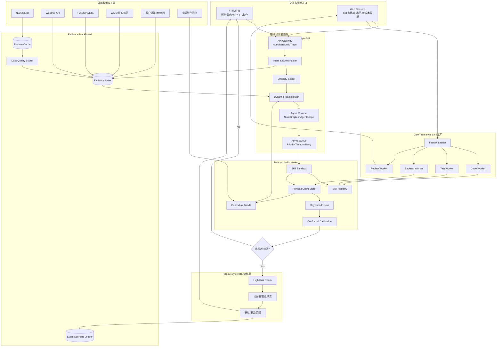
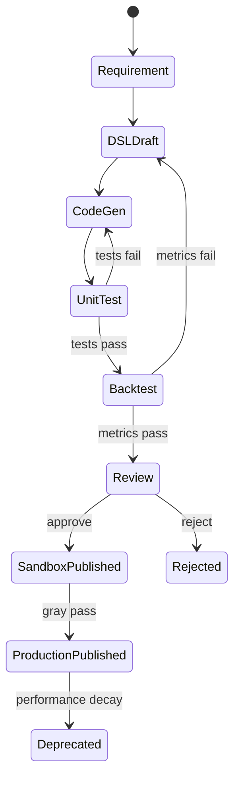

# 中转场地在线预测智能体集群技术开发需求方案

> 版本：v1.0  
> 日期：2026-06-02  
> 依据：`中转场地在线预测智能体集群技术白皮书.md v1.1`  
> 目标：将“AgentScope/LangGraph 在线主控 + HiClaw HITL + ClawTeam Skill 工厂 + Evidence Blackboard + 统计校准”的架构选型，拆解为可研发、可验收、可度量的技术开发需求。  

---

## 0. 执行摘要

本方案不是传统“模型研发需求”，而是一个面向物流边缘预测的 **Agentic Forecasting Platform** 开发需求方案。系统目标不是让 LLM 直接猜件量，而是构建一套可控、可审计、可扩展、可自进化的预测智能体基础设施。

最终工程形态：

```text
在线预测主链路：AgentScope-first / LangGraph-first 双候选 PoC 后确定
HITL 协作层：HiClaw-style 高风险协作房间
Skill 供给侧：ClawTeam-style 离线 Skill 工厂
协议层：MCP/A2A-inspired Skill Card + Forecast Claim Schema
预测核心：Evidence Blackboard + Bayesian Fusion + Conformal Calibration + Contextual Bandit
交互层：钉钉/企微卡片 + Web Console
```

核心工程约束：

| 维度 | 原则 |
|---|---|
| 性能 | 80% 常规任务走低成本快速链路；20% 高风险任务才触发多 Agent 协商和 HITL |
| 效率 | 数据、证据、Skill 结果尽可能复用缓存；任务按难度动态扩缩容 |
| Token 成本 | Token 是预算资源，必须有分级、限额、熔断和复盘报表 |
| 效果 | 不只看 MAPE，还看区间覆盖率、人工调整率、采纳率、高风险召回率 |
| 智能化深度 | 从 L1 自动取数预测，逐步演进到 L5 自主生成/评审/发布 Skill |

---

# 1. 总体目标与边界

## 1.1 业务目标

| 目标 | 描述 | 首期验收口径 |
|---|---|---|
| 提升边缘场景可用性 | 覆盖暴雨、大客户临时出货、倒货、修路、交通管制、退货潮等传统模型失效场景 | 试点场地 5 类事件均可生成结构化预测主张 |
| 降低人工预测耗时 | 将 Excel + 电话 + 群消息整理从 30-60 分钟降到分钟级 | 常规任务 P95 ≤ 60 秒，高风险任务 P95 ≤ 5 分钟，不含人工等待 |
| 提升信任与可解释 | 每个预测值必须可追踪证据、Skill、参数、协商与人工调整 | 100% 任务具备 trace_id 与 ForecastClaim 记录 |
| 支持业务自助创新 | 业务自然语言沉淀新预测方法，经回放评审后进入 Skill 市场 | 首期支持 3 个业务自定义 Skill 从草案到 Sandbox |
| 建立自进化闭环 | 基于 T+1 实际误差和人工调整更新 Skill 权重 | 每日自动更新 Skill reliability，保留审计 |

## 1.2 技术目标

| 目标 | 描述 |
|---|---|
| 双候选主控验证 | 同时验证 AgentScope-first 与 LangGraph-first，基于同一套 Claim Schema 和回放集评估 |
| 证据中心化 | 所有 Agent 只能引用 Evidence Blackboard 中的证据，不允许无来源推断 |
| Skill 标准化 | 每个预测 Skill 必须有 Skill Card、输入 Schema、输出 Claim、回放指标 |
| 协商有界化 | Debate 不是开放聊天，必须有最大轮次、Token 预算、可审计消息格式 |
| HITL 事件化 | 人工覆盖、确认、回滚全部写入 Event Ledger，不允许物理覆盖历史 |
| 成本可控 | 任务级、Agent 级、用户级、场地级 Token 与执行成本可观测、可限流 |

## 1.3 非目标

| 非目标 | 说明 |
|---|---|
| 不建设单一大一统预测模型 | 平稳场景可接入现有时序模型，边缘场景靠 Skill 与事件推理增强 |
| 不让 LLM 直接输出最终件量 | LLM 可解析事件、生成解释、辅助 Skill 草案，但最终预测必须来自可执行 Skill 与统计融合 |
| 不让 HiClaw 承载全部在线 serving | HiClaw 只用于高风险 HITL 协作房间 |
| 不让 ClawTeam 进入生产预测主链路 | ClawTeam 用于离线 Skill 工厂、回放、参数搜索、评审 |
| 不允许无审计的业务覆盖 | 所有人工动作都必须有 actor、reason、before/after、timestamp |

---

# 2. 总体架构与开发域划分

## 2.1 目标架构



## 2.2 开发域拆分

| 开发域 | 代码/服务边界 | 核心产物 |
|---|---|---|
| D1 在线主控 | API Gateway、Intent、Difficulty、Router、Runtime Adapter | 可运行的预测状态机与任务调度 |
| D2 Evidence Blackboard | 数据接入、证据索引、质量评分、事件账本 | 可引用、可审计、可评分的证据层 |
| D3 Forecast Skills Market | Skill Registry、Sandbox、Claim Store、Skill 协议 | 标准化 Skill 生命周期 |
| D4 算法融合与校准 | Bayesian Fusion、Conformal Calibration、Disagreement、Bandit | 分布式预测、区间校准、自进化 |
| D5 HITL 协作层 | HiClaw-style Room、IM 卡片、人工覆盖、回滚 | 高风险任务的人机闭环 |
| D6 Skill 工厂 | ClawTeam-style Worker、生成、测试、回放、评审 | 业务新方法快速生产线 |
| D7 观测与成本治理 | Trace、Metrics、Token Budget、Cost Report、Alert | 性能/成本/效果统一治理 |
| D8 安全与权限 | RBAC、数据权限、沙箱策略、审计 | 可上线的企业级安全基线 |

---

# 3. 性能、效率、成本、效果与智能化等级指标

## 3.1 任务分级与 SLA

| 任务等级 | 场景 | Agent 数 | Debate | HITL | 延迟目标 | Token 预算 | 占比目标 |
|---|---|---:|---:|---:|---:|---:|---:|
| L0 纯规则/缓存 | 用户查已有预测、查看历史结果 | 0 | 0 | 否 | P95 ≤ 3s | 0 | 20% |
| L1 常规平稳预测 | 无事件、数据完整、历史波动低 | 1-2 | 0 | 否 | P95 ≤ 30s | ≤ 2k | 40% |
| L2 多 Skill 常规预测 | 多维度、轻微波动、有基础校验 | 2-3 | 0 | 条件触发 | P95 ≤ 60s | ≤ 6k | 20% |
| L3 边缘事件预测 | 天气/客户/倒货/修路等事件明确 | 3-5 | 1 | 可能 | P95 ≤ 180s | ≤ 20k | 15% |
| L4 高风险协作预测 | 高分歧、高影响、低证据 | 4-6 | 1-2 | 是 | 系统 P95 ≤ 300s | ≤ 40k | 5% |
| L5 Skill 生成/评审 | 自然语言生成新 Skill、回放评审 | 多 Worker | N/A | 管理员评审 | 离线 ≤ 30min | 项目级预算 | 非在线 |

## 3.2 性能指标

| 指标 | P0 目标 | P1 目标 | 说明 |
|---|---:|---:|---|
| 在线任务成功率 | ≥ 99% | ≥ 99.5% | 排除外部数据源完全不可用 |
| 常规任务端到端延迟 | P95 ≤ 60s | P95 ≤ 30s | 从 IM 请求到卡片返回 |
| 高风险任务系统处理延迟 | P95 ≤ 300s | P95 ≤ 180s | 不含人工等待 |
| 单场地日批处理吞吐 | ≥ 100 task/day | ≥ 500 task/day | 包含多维度预测 |
| 并发在线任务 | ≥ 50 | ≥ 200 | 首期/规模化 |
| Skill Sandbox 冷启动 | P95 ≤ 5s | P95 ≤ 2s | 容器/解释器启动 |
| Evidence 查询延迟 | P95 ≤ 2s | P95 ≤ 500ms | 命中缓存时 |
| 回放任务吞吐 | ≥ 1k runs/hour | ≥ 10k runs/hour | Skill 工厂评审 |

## 3.3 Token 与成本指标

| 指标 | 目标 | 强制策略 |
|---|---:|---|
| 常规任务平均 Token | ≤ 3k | L1/L2 禁止 Debate，使用模板化解释 |
| 边缘任务平均 Token | ≤ 15k | 只向 Agent 传 evidence summary，不传全量原文 |
| 高风险任务最大 Token | ≤ 40k | 超预算降级为 HITL + 结构化证据摘要 |
| 月度 Token 预算超限 | 0 | 用户/场地/任务等级三级限额 |
| 无效 Token 占比 | ≤ 15% | 统计重复上下文、无引用推理、超长解释 |
| Debate 成本占比 | ≤ 25% | Debate 只在分歧阈值触发，最多 2 轮 |
| Skill 工厂成本 | 单独预算 | 离线批处理限额，不影响在线 serving |

Token 成本控制原则：

```text
能用结构化数据不用自然语言；
能传 evidence_ref 不传原文；
能用小模型做意图/分类不用大模型；
能用规则/统计完成不触发 LLM；
能单 Agent 完成不组 Team；
能融合完成不 Debate；
能后台回放不在线推理。
```

## 3.4 预测效果指标

| 指标 | 首期目标 | 稳定期目标 | 说明 |
|---|---:|---:|---|
| 常规场景 MAPE | ≤ 8%-12% | ≤ 6%-10% | 需按场地类型分桶 |
| 边缘事件场景 MAPE | 较人工基线降低 ≥ 5% | 降低 ≥ 10%-15% | 对比人工最终值和实际值 |
| P80 区间覆盖率 | 75%-85% | 78%-85% | 过低代表过度自信，过高代表区间太宽 |
| 高风险事件召回率 | ≥ 85% | ≥ 90% | 是否正确触发 HITL/协作房间 |
| 人工调整率 | 首期可不降 | 稳定期下降 ≥ 20% | 不能为降低而牺牲安全 |
| 用户采纳率 | ≥ 60% | ≥ 75% | 确认采用/返回预测 |
| Skill 自动权重有效性 | 权重 Top3 Skill 平均 MAPE 优于随机 ≥ 10% | ≥ 20% | 验证 Bandit 是否有效 |

## 3.5 智能化技术深度等级

| 等级 | 名称 | 能力描述 | 开发目标 |
|---|---|---|---|
| I0 | 自动化脚本 | 固定模板、固定取数、固定公式 | 仅用于基线 |
| I1 | 可配置 Skill | Skill Card + 参数卡槽 + 标准 Claim | Phase 1 必达 |
| I2 | 动态路由 | 按难度、数据质量、场地画像选择 Skill | Phase 2 必达 |
| I3 | 有界协商 | 高分歧触发结构化 Debate 与证据复核 | Phase 3 必达 |
| I4 | 自适应进化 | 基于误差、采纳、人工调整自动更新权重 | Phase 3 必达 |
| I5 | Skill 自生成 | 自然语言生成 Skill，自动测试/回放/评审 | Phase 4 目标 |

---

# 4. 详细开发需求

需求编号规则：

```text
REQ-{开发域}-{序号}
优先级：P0 必须首期完成；P1 试点期完成；P2 规模化完成
```

## 4.1 D1 在线主控服务

| 需求编号 | 优先级 | 需求描述 | 验收标准 | 性能/成本约束 | 依赖 |
|---|---|---|---|---|---|
| REQ-CTRL-001 | P0 | 建立统一 API Gateway，支持 IM/Web 请求、鉴权、trace_id、幂等 task_id | 100% 请求生成 trace_id；重复请求不会重复发布结果 | Gateway P95 ≤ 200ms | 企业 SSO/IM |
| REQ-CTRL-002 | P0 | 实现 Intent & Event Parser，解析场地、日期、维度、事件、用户意图 | 100 条真实话术准确率 ≥ 90%，低置信触发澄清 | 单次解析 Token ≤ 800；P95 ≤ 3s | 场地/用户映射 |
| REQ-CTRL-003 | P0 | 实现 Difficulty Scorer，输出任务等级 L0-L5 与原因 | 回放集中难度分桶与人工标注一致率 ≥ 80% | 规则优先，LLM 仅兜底 | Evidence 质量指标 |
| REQ-CTRL-004 | P0 | 完成 AgentScope-first 与 LangGraph-first 双候选 PoC | 同一批 200 个回放任务输出一致 Claim Schema；产出选型报告 | PoC 周期 ≤ 2 周 | ForecastClaim v1 |
| REQ-CTRL-005 | P0 | 实现 Dynamic Team Router，按难度、场地画像、数据质量、历史权重选择 Skill | L1/L2 选择 1-3 个 Skill；L3/L4 选择 3-6 个 Skill；选择理由可解释 | 常规任务 Router P95 ≤ 500ms | Skill Registry/Bandit |
| REQ-CTRL-006 | P0 | 实现异步任务状态机：parse→evidence→route→execute→fuse→hitl→publish | 状态可恢复；任一节点失败可定位 | 状态转移写入 Event Ledger | Queue/DB |
| REQ-CTRL-007 | P1 | 支持批量预测任务，按区域/场地/维度批处理 | 50 场地 × 2 天 × 3 维度可批量完成 | 批处理不挤占在线高优任务 | 调度队列 |
| REQ-CTRL-008 | P1 | 支持任务取消、暂停、重跑、按版本回放 | 任意 trace_id 可重跑并对比结果 | 重跑默认离线执行，不消耗在线 SLA | Event Ledger |

主控选型 PoC 评分表：

| 评分维度 | 权重 | AgentScope-first 评估 | LangGraph-first 评估 |
|---|---:|---|---|
| 状态可控与回滚 | 20% | 状态事件、Agent Service、Studio 支持程度 | StateGraph checkpoint、条件边、可恢复性 |
| HITL 集成成本 | 15% | Human interaction、event stream 集成 | 自建 HITL node 成本 |
| 吞吐与延迟 | 20% | 并发 Agent Service 性能 | Async queue + StateGraph 性能 |
| 审计与可观测 | 15% | Studio/trace/log 能力 | 自建 trace/metrics 成本 |
| 企业集成成本 | 15% | 与现有 Python/FastAPI/权限体系适配 | 轻量嵌入成本 |
| 长期平台能力 | 15% | Skills 市场、Agent 服务化、协议扩展 | 自建平台工作量 |

## 4.2 D2 Evidence Blackboard

| 需求编号 | 优先级 | 需求描述 | 验收标准 | 性能/成本约束 | 依赖 |
|---|---|---|---|---|---|
| REQ-EVD-001 | P0 | 定义 Evidence Schema，支持 structured/ref/text/attachment 四类证据 | 所有 Claim 必须引用 evidence_ref；无引用 Claim 被拒绝 | evidence_ref 长度 ≤ 128 | Schema Registry |
| REQ-EVD-002 | P0 | 接入 NL2SQL/BI，获取历史到件、班次、库区、流向、客户结构 | 核心字段完整率 ≥ 95%；缺失字段显式标记 | 查询 P95 ≤ 5s，缓存命中 P95 ≤ 500ms | 数据权限 |
| REQ-EVD-003 | P0 | 接入天气、TMS/ETA、WMS/分拣、客户通知等多源证据 | 每类证据可写入 Evidence Index 并被 Claim 引用 | 文本证据先摘要再入 Agent，上限 1k tokens | 外部接口 |
| REQ-EVD-004 | P0 | 实现 Data Quality Scorer，输出 completeness、freshness、consistency、anomaly | 数据质量评分可用于 Router 与 HITL | 评分 P95 ≤ 1s | 质量规则 |
| REQ-EVD-005 | P1 | 实现事件抽取与归一化：促销、天气、倒货、修路、交通管制、退货潮 | 真实事件文本 F1 ≥ 0.80；低置信触发人工确认 | 小模型优先，单次 ≤ 1.5k tokens | 事件字典 |
| REQ-EVD-006 | P1 | 实现证据版本化与时点快照 | 任意预测可回放当时看到的证据版本 | 快照只存引用和摘要，控制存储成本 | Event Ledger |
| REQ-EVD-007 | P1 | 实现相似历史日检索 | 给定事件/场地/天气/日期类型返回 TopK 相似日 | TopK P95 ≤ 2s | 特征索引 |

Evidence Schema：

```json
{
  "evidence_id": "evd_weather_20260602_001",
  "type": "text_alert",
  "source": "weather_api",
  "site_scope": ["021WD"],
  "time_range": ["2026-06-02T00:00:00+08:00", "2026-06-03T23:59:59+08:00"],
  "summary": "上海金山暴雨橙色预警，预计晚间降雨强度较高。",
  "quality": {
    "freshness": 0.95,
    "completeness": 0.80,
    "trust": 0.90
  },
  "raw_uri": "object://evidence/weather/20260602/001.json",
  "created_at": "2026-06-02T15:20:00+08:00"
}
```

## 4.3 D3 Forecast Skills Market

| 需求编号 | 优先级 | 需求描述 | 验收标准 | 性能/成本约束 | 依赖 |
|---|---|---|---|---|---|
| REQ-SKL-001 | P0 | 定义 Skill Card v1，覆盖能力、输入、输出、安全、评估、版本 | 所有生产 Skill 必须有 Skill Card | Card lint P95 ≤ 300ms | Schema Registry |
| REQ-SKL-002 | P0 | 定义 ForecastClaim v1，支持 point/distribution/delta/risk 四类主张 | 100% Skill 输出可被 schema 校验 | Claim 校验失败不进入 Fusion | Claim Store |
| REQ-SKL-003 | P0 | 建立 Skill Registry，支持发布、禁用、回滚、灰度 | 管理员可按版本回滚 Skill | Registry 查询 P95 ≤ 200ms | RBAC |
| REQ-SKL-004 | P0 | 实现 Skill Sandbox，限制 CPU、内存、运行时、网络、文件访问 | 恶意脚本无法访问未授权资源；超时强杀 | 在线 Skill timeout 默认 30s | 容器/沙箱 |
| REQ-SKL-005 | P0 | 首批内置 8 类 Skill：时序基线、同环比、客户事件、天气事件、运力 ETA、库区容量、空间类比、校准 | 每类 Skill 至少通过 100 条回放样本 | 常规 Skill 不依赖大模型 | 数据样本 |
| REQ-SKL-006 | P1 | 支持 Skill 组合模板：串联、并联、投票、delta 叠加 | Composer 生成模板后可回放执行 | 模板不允许绕过 Sandbox | Composer |
| REQ-SKL-007 | P1 | 支持 Skill 灰度发布和按场地白名单启用 | 灰度期间可对比新旧 Skill 表现 | 灰度不影响主预测 SLA | Registry |
| REQ-SKL-008 | P2 | 支持 MCP/A2A-inspired 对外 Skill 能力描述 | 外部系统可发现只读 Skill Card | 不开放任意执行权限 | API Gateway |

ForecastClaim v1：

```json
{
  "schema_version": "forecast.claim.v1",
  "trace_id": "tr_001",
  "skill_id": "weather_delta_v2",
  "skill_version": "2.1.0",
  "target": {
    "site_code": "021WD",
    "target_date": "2026-06-03",
    "dimension": "site_total",
    "horizon": "T+1"
  },
  "claim": {
    "type": "delta_distribution",
    "mean_delta": -32000,
    "p10_delta": -56000,
    "p90_delta": -9000,
    "confidence": 0.71
  },
  "evidence_refs": ["evd_weather_20260602_001"],
  "assumptions": ["暴雨主要造成班次迁移，全天量影响较小"],
  "risk_flags": ["road_closure_data_missing"],
  "cost": {
    "runtime_ms": 1832,
    "input_tokens": 620,
    "output_tokens": 180,
    "estimated_cost_cny": 0.02
  }
}
```

## 4.4 D4 算法融合、分歧与自进化

| 需求编号 | 优先级 | 需求描述 | 验收标准 | 性能/成本约束 | 依赖 |
|---|---|---|---|---|---|
| REQ-ALG-001 | P0 | 实现 Bayesian Fusion，将基线、事件 delta、容量约束融合为分布 | 回放可输出 mean、P10、P50、P90 | P95 ≤ 500ms | Claim Store |
| REQ-ALG-002 | P0 | 实现分歧指数 Disagreement Score | 高分歧样本召回 ≥ 85% | 不触发 LLM | Claim Store |
| REQ-ALG-003 | P0 | 实现 Conformal Calibration，按场地/事件/维度分桶校准区间 | P80 覆盖率在 75%-85% | 每日离线更新分位数 | 实际值回流 |
| REQ-ALG-004 | P1 | 实现 Bounded Debate 触发策略和最大轮次控制 | L3 最多 1 轮，L4 最多 2 轮；超限转 HITL | 高风险任务 ≤ 40k tokens | Debate Engine |
| REQ-ALG-005 | P1 | 实现 Contextual Bandit 更新 Skill 权重 | Top 权重 Skill 表现优于随机 ≥ 10% | 每日离线更新，不影响在线 SLA | Actual 回流 |
| REQ-ALG-006 | P1 | 实现异常离群处理：离群但证据强保留，离群且证据弱降权 | 离群规则可解释并写入审计 | 不直接删除 Claim | Evidence |
| REQ-ALG-007 | P2 | 实现 What-if 模拟：新增/移除事件证据后重算 | 业务可比较两个版本差异 | 默认离线执行 | HITL |

分歧公式：

```text
Disagreement =
  0.30 * CoefVar(point_predictions)
+ 0.20 * (1 - AvgIntervalOverlap)
+ 0.20 * EvidenceConflictRate
+ 0.15 * RankInstability
+ 0.15 * BusinessImpactScore
```

Debate 触发：

```python
def debate_policy(task_level, disagreement, business_impact, token_budget):
    if task_level <= 2 and disagreement < 0.35:
        return {"rounds": 0, "hitl": False}
    if token_budget.remaining < 8000:
        return {"rounds": 0, "hitl": True, "reason": "token_budget_low"}
    if disagreement >= 0.55 or business_impact >= 0.8:
        return {"rounds": 2, "hitl": True}
    if disagreement >= 0.35:
        return {"rounds": 1, "hitl": False}
    return {"rounds": 0, "hitl": False}
```

## 4.5 D5 HiClaw-style HITL 协作层

| 需求编号 | 优先级 | 需求描述 | 验收标准 | 性能/成本约束 | 依赖 |
|---|---|---|---|---|---|
| REQ-HITL-001 | P0 | 实现 HITL Gate，基于风险、分歧、低证据、业务影响判断是否人工介入 | 高风险样本召回 ≥ 85% | Gate P95 ≤ 300ms | Disagreement |
| REQ-HITL-002 | P0 | IM 卡片支持确认、上调、下调、按维度调整、查看证据、回滚 | 100% 人工动作写入 Event Ledger | 卡片响应 P95 ≤ 3s | IM 权限 |
| REQ-HITL-003 | P1 | 高风险任务创建 HiClaw-style 协作房间 | 房间包含证据墙、Agent 主张、操作按钮 | 仅 L4 默认创建，控制协作噪音 | HiClaw Adapter |
| REQ-HITL-004 | P1 | 支持房间内 Agent 摘要而非全量上下文 | 每个 Agent 摘要 ≤ 500 tokens | 房间总摘要 ≤ 5k tokens | Claim Store |
| REQ-HITL-005 | P1 | 支持人工覆盖回滚和版本比较 | 任意覆盖可追加 rollback event | 不物理删除历史 | Event Ledger |
| REQ-HITL-006 | P2 | 支持多人审批策略：场地主管确认、区域经理二次确认 | 大额调整触发二级审批 | 阈值可配置 | RBAC |

人工动作协议：

```json
{
  "action_type": "human.override",
  "trace_id": "tr_001",
  "actor_id": "u_021wd_manager",
  "target": {
    "site_code": "021WD",
    "target_date": "2026-06-03",
    "dimension": "night_shift"
  },
  "before": {"mean": 318000},
  "after": {"mean": 348000},
  "reason": "客户包机临时加量，已电话确认",
  "evidence_refs": ["evd_customer_call_001"],
  "created_at": "2026-06-02T18:30:00+08:00"
}
```

## 4.6 D6 ClawTeam-style Skill 工厂

| 需求编号 | 优先级 | 需求描述 | 验收标准 | 性能/成本约束 | 依赖 |
|---|---|---|---|---|---|
| REQ-FAC-001 | P1 | 建立 Skill Factory 工作流：需求→草案→代码→测试→回放→评审→发布 | 端到端生成 3 个 Sandbox Skill | 离线预算独立 | ClawTeam 环境 |
| REQ-FAC-002 | P1 | Code Worker 根据 Skill DSL 生成 Python Skill 模板 | 生成代码通过静态扫描和单元测试 | 禁止网络/危险 import | Sandbox |
| REQ-FAC-003 | P1 | Test Worker 自动生成 schema 测试、边界测试、伪数据测试 | 测试覆盖率 ≥ 80% | 失败不得进入回放 | Schema |
| REQ-FAC-004 | P1 | Backtest Worker 执行历史回放和参数搜索 | 输出 MAPE、覆盖率、延迟、成本报告 | 回放限流，不影响在线 | 回放数据 |
| REQ-FAC-005 | P1 | Review Worker 生成发布评审报告 | 管理员可一键批准/驳回 | 报告摘要 ≤ 2k tokens | Console |
| REQ-FAC-006 | P2 | 支持业务自然语言到 Skill DSL | 低风险模板转换准确率 ≥ 80%，高风险需人工编辑 | 不允许直接发布生产 | LLM/DSL |

Skill 工厂状态机：



## 4.7 D7 观测、成本治理与评估

| 需求编号 | 优先级 | 需求描述 | 验收标准 | 性能/成本约束 | 依赖 |
|---|---|---|---|---|---|
| REQ-OBS-001 | P0 | 全链路 Trace：request、evidence、skill、claim、fusion、hitl、publish | 100% 任务可按 trace_id 回放 | 日志采样不影响审计 | Gateway |
| REQ-OBS-002 | P0 | 采集性能指标：延迟、成功率、超时、队列深度、缓存命中 | Dashboard 可按场地/任务等级过滤 | 指标写入 P95 ≤ 100ms | Metrics |
| REQ-OBS-003 | P0 | 采集成本指标：Token、模型调用、Sandbox 时间、回放资源 | 任务级成本可见；超预算告警 | 成本延迟 ≤ 5min | Token Meter |
| REQ-OBS-004 | P1 | 效果评估面板：MAPE、P80 coverage、人工调整率、采纳率、高风险召回 | 支持按场地/事件/Skill 分桶 | 每日更新 | Actual 回流 |
| REQ-OBS-005 | P1 | Token Budget Manager：按任务等级、用户、场地、Agent 限额 | 超预算自动降级或转 HITL | L4 单任务 ≤ 40k tokens | LLM Gateway |
| REQ-OBS-006 | P1 | 异常告警：数据源故障、Skill 异常、成本暴涨、区间失准 | 告警到管理员 IM 群 | 降噪：同类 10min 聚合 | Alert |
| REQ-OBS-007 | P2 | A/B 与 Champion/Challenger 实验平台 | 新 Skill 可灰度对比旧 Skill | 实验不影响主链路稳定 | Registry |

成本报表维度：

| 维度 | 指标 |
|---|---|
| 用户 | 请求数、平均 Token、HITL 次数、采纳率 |
| 场地 | 预测次数、边缘事件次数、成本/任务、MAPE |
| Skill | 调用次数、成功率、平均成本、边际效果 |
| 任务等级 | L0-L5 占比、延迟、Token、人工介入率 |
| 数据源 | 查询次数、缓存命中、失败率、平均延迟 |

## 4.8 D8 安全、权限与合规

| 需求编号 | 优先级 | 需求描述 | 验收标准 | 性能/成本约束 | 依赖 |
|---|---|---|---|---|---|
| REQ-SEC-001 | P0 | RBAC：场地运营、区域经理、预测管理员、数据科学家 | 越权访问 100% 拦截并审计 | 权限判断 P95 ≤ 50ms | IAM |
| REQ-SEC-002 | P0 | 数据域权限：场地、区域、客户敏感信息脱敏 | 非授权用户不可见客户明细 | 脱敏不破坏聚合统计 | Data Catalog |
| REQ-SEC-003 | P0 | Sandbox 安全策略：禁网络、禁危险 import、限 CPU/内存/文件 | 安全测试通过率 100% | 超限强杀 | Runtime |
| REQ-SEC-004 | P0 | Prompt Injection 防护：外部文本只作为证据，不作为系统指令 | 注入样本不可改变系统策略 | 文本进入 Agent 前清洗 | Evidence |
| REQ-SEC-005 | P1 | Skill 发布审批：生产 Skill 必须管理员批准 | Draft/Sandbox 不可被生产 Router 选择 | 审批写审计 | Registry |
| REQ-SEC-006 | P1 | 审计留存策略：预测、人工动作、Skill 版本、证据引用 | 任一结果可追溯到版本和证据 | 原始敏感文本按策略归档 | Compliance |

---

# 5. 数据模型与接口需求

## 5.1 核心表/集合

| 表/集合 | 用途 | 关键字段 |
|---|---|---|
| forecast_task | 在线预测任务 | task_id, trace_id, user_id, site_code, level, status |
| evidence_record | 证据记录 | evidence_id, type, source, summary, raw_uri, quality |
| skill_registry | Skill 注册 | skill_id, version, card_json, status, owner |
| forecast_claim | Skill 主张 | claim_id, task_id, skill_id, claim_json, cost_json |
| fusion_result | 融合结果 | task_id, mean, p10, p50, p90, calibration_bucket |
| hitl_event | 人工动作 | event_id, actor, before_json, after_json, reason |
| skill_reliability | Skill 权重 | skill_id, bucket, posterior_mu, posterior_sigma, sample_count |
| cost_ledger | 成本账本 | trace_id, component, tokens, runtime_ms, cost |

## 5.2 关键 API

### 发起预测

```http
POST /api/v1/forecast/tasks
```

```json
{
  "user_id": "u_001",
  "text": "预测明天金山到件量，考虑得物直播和暴雨",
  "site_code": "021WD",
  "target_dates": ["2026-06-03"],
  "dimensions": ["site_total", "shift"]
}
```

### 查询预测详情

```http
GET /api/v1/forecast/tasks/{task_id}
```

返回必须包含：

```json
{
  "task_id": "task_001",
  "trace_id": "tr_001",
  "level": "L3",
  "forecast": {
    "mean": 918000,
    "p10": 872000,
    "p90": 962000
  },
  "claims": [],
  "evidence_refs": [],
  "cost": {},
  "hitl": {
    "required": true,
    "reason": "high_disagreement"
  }
}
```

### 人工覆盖

```http
POST /api/v1/forecast/tasks/{task_id}/human-actions
```

```json
{
  "action_type": "override",
  "target_dimension": "site_total",
  "new_mean": 938000,
  "reason": "客户临时包机，电话确认",
  "evidence_refs": ["evd_customer_call_001"]
}
```

### 注册 Skill

```http
POST /api/v1/skills
```

必须提交：

- Skill Card；
- input_schema；
- output_schema；
- sandbox policy；
- test cases；
- backtest report。

---

# 6. 分阶段交付计划

## 6.1 Phase 0：架构 PoC 与标准冻结

周期：2-3 周。

| 交付 | 验收 |
|---|---|
| ForecastClaim v1 / SkillCard v1 / Evidence Schema v1 | 通过 10 个真实场景建模 |
| AgentScope-first vs LangGraph-first PoC | 同一批 200 个任务回放，对比性能、审计、开发复杂度 |
| 首批数据口径冻结 | 8 个试点场地核心字段确认 |
| Token Budget Policy v1 | L0-L5 预算表和降级策略确定 |

## 6.2 Phase 1：在线预测 MVP

周期：4-6 周。

| 交付 | 验收 |
|---|---|
| API Gateway + Intent Parser + Difficulty Scorer | 真实话术解析准确率 ≥ 90% |
| Evidence Blackboard MVP | 历史件量、天气、客户通知可入库并被引用 |
| 2-3 个基础 Skill | 输出标准 ForecastClaim |
| Bayesian Fusion MVP | 输出点预测和 P80 区间 |
| IM 卡片 + 人工覆盖 | 人工动作写 Event Ledger |
| 基础观测与成本报表 | trace、latency、token、cost 可见 |

## 6.3 Phase 2：Skills 市场与离线 Skill 工厂

周期：8-10 周。

| 交付 | 验收 |
|---|---|
| Skill Registry + Composer | 管理员可启停、灰度、回滚 Skill |
| ClawTeam-style Skill Factory | 3 个业务自然语言 Skill 进入 Sandbox |
| Backtest & Review | 自动生成回放报告和发布建议 |
| 首批 8 类 Skill | 覆盖常规、天气、客户、运力、容量、空间类比 |
| 成本治理增强 | 用户/场地/任务等级预算生效 |

## 6.4 Phase 3：动态团队、HiClaw HITL、自进化

周期：10-12 周。

| 交付 | 验收 |
|---|---|
| Dynamic Team Router | L1-L4 按难度动态选择 Skill |
| Bounded Debate | 高分歧触发 1-2 轮结构化协商 |
| HiClaw-style 协作房间 | L4 任务可进入协作房间并回写决策 |
| Contextual Bandit | 每日更新 Skill 权重 |
| Conformal Calibration | P80 覆盖率稳定在 75%-85% |

## 6.5 Phase 4：规模化商业平台

周期：12 周+。

| 交付 | 验收 |
|---|---|
| 多区域多租户 | 50+ 场地稳定运行 |
| A2A/MCP Gateway | 外部系统可发现受控 Skill 能力 |
| Champion/Challenger 实验 | 新 Skill 可灰度替换旧 Skill |
| 方法论社区 | 业务可分享模板并查看效果排名 |

---

# 7. 验收测试设计

## 7.1 测试集构成

| 测试集 | 样本量 | 用途 |
|---|---:|---|
| 常规平稳日 | ≥ 500 | 验证低成本链路 |
| 天气事件 | ≥ 100 | 验证事件 delta 和 HITL |
| 大客户事件 | ≥ 100 | 验证客户通知融合 |
| 倒货/溢出 | ≥ 80 | 验证空间/容量 Skill |
| 数据缺失/异常 | ≥ 100 | 验证降级和质量评分 |
| 高分歧构造样本 | ≥ 50 | 验证 Debate 和 HiClaw |

## 7.2 性能压测

| 测试 | 场景 | 通过标准 |
|---|---|---|
| 在线并发 | 50/100/200 并发任务 | 成功率 ≥ 99%，常规任务 P95 ≤ 60s |
| 批量任务 | 50 场地 × 2 日期 × 3 维度 | 任务完成率 ≥ 99% |
| Skill Sandbox | 1000 次 Skill 执行 | 超时/资源超限可控 |
| Token 限额 | 构造超长文本事件 | 自动摘要/截断/降级 |
| 外部数据故障 | NL2SQL/Weather/TMS 故障注入 | 不崩溃，触发缓存/降级/HITL |

## 7.3 效果评估

| 评估 | 方法 |
|---|---|
| MAPE | 按场地、事件、维度、horizon 分桶 |
| 区间覆盖 | P80/P90 coverage 分桶检查 |
| HITL 有效性 | 被 HITL 标记的任务实际误差是否显著更高 |
| Debate 有效性 | Debate 前后分歧与误差是否改善 |
| Bandit 有效性 | 权重 Top Skill 是否优于随机/固定策略 |
| 成本收益 | 每增加 1k tokens 带来的 MAPE/风险改善 |

---

# 8. 风险与缓解

| 风险 | 等级 | 描述 | 缓解 |
|---|---|---|---|
| 主控框架选错 | 高 | AgentScope/LangGraph 选型影响长期架构 | Phase 0 双候选 PoC，用统一任务集量化比较 |
| Token 成本失控 | 高 | 多 Agent + Debate 容易放大成本 | L0-L5 预算、Evidence summary、最大轮次、成本看板 |
| 预测效果被 LLM 幻觉污染 | 高 | 事件解释可能无证据 | 强制 evidence_ref，无证据 Claim 拒绝进入 Fusion |
| Skill 工厂生成不安全代码 | 高 | 自然语言生成 Skill 可能引入风险 | 静态扫描、Sandbox、Review、禁止直接生产发布 |
| HITL 过度触发 | 中 | 业务被频繁打扰 | 难度分级、阈值调优、房间只在 L4 触发 |
| 数据口径不一致 | 高 | 场地定义不同导致预测不可比 | Phase 0 冻结口径，Evidence 中显式记录口径版本 |
| Bandit 早期误学 | 中 | 样本少导致权重偏移 | 最小样本量门槛、权重上下限、人工审核异常漂移 |
| 高并发回放影响在线 | 中 | Skill 工厂耗资源 | 离线队列隔离、资源配额、低峰执行 |

---

# 9. 研发组织与角色

| 角色 | 职责 |
|---|---|
| 架构负责人 | 主控选型、边界治理、性能预算、技术评审 |
| Agent 平台工程师 | AgentScope/LangGraph Runtime、Router、状态机、HITL Gateway |
| 数据工程师 | Evidence Blackboard、数据接入、质量评分、实际值回流 |
| 算法工程师 | Skill 设计、Fusion、Calibration、Bandit、效果评估 |
| 后端工程师 | API、Registry、Claim Store、Event Ledger、成本账本 |
| 前端/IM 工程师 | 钉钉/企微卡片、Web Console、协作房间入口 |
| MLOps/DevOps | Sandbox、队列、观测、告警、资源隔离 |
| 业务专家 | 事件字典、口径确认、Skill 评审、HITL 规则 |
| 安全工程师 | RBAC、数据脱敏、Prompt Injection、代码安全 |

---

# 10. 研发优先级总表

| 优先级 | 必须完成的能力 | 不完成的后果 |
|---|---|---|
| P0 | Claim Schema、Evidence、主控 PoC、基础 Skill、Fusion、IM HITL、Trace/Cost | 无法形成可信在线闭环 |
| P1 | Skill 市场、ClawTeam 工厂、Dynamic Router、Debate、HiClaw 房间、Bandit | 无法体现智能化深度和边缘场景优势 |
| P2 | A2A/MCP Gateway、方法社区、多租户、实验平台、高级审批 | 可先不做，不影响试点，但影响规模化商业化 |

---

## 最终开发判断

本项目的研发重点不是“把多 Agent 跑起来”，而是建立一套 **受预算约束、受证据约束、受统计校准约束、受人类责任约束** 的 Agentic Forecasting 系统。

最关键的工程抓手有五个：

```text
1. ForecastClaim Schema：让所有智能体输出可比较、可融合、可审计。
2. Evidence Blackboard：让所有推理有证据来源，防止幻觉污染预测。
3. Difficulty-aware Router：让 80% 常规任务低成本完成，20% 边缘任务深度推理。
4. Token Budget Manager：让智能化深度受成本约束，不让 Debate 无限膨胀。
5. HITL + Event Sourcing：让业务覆盖成为系统学习资产，而不是线下 Excel 修正。
```

如果只能先做一个 MVP，建议范围是：

```text
2 个场地 + 3 类事件 + 5 个 Skill + 1 套 Claim Schema
+ AgentScope/LangGraph 双候选 PoC
+ 基础 Evidence Blackboard
+ Bayesian Fusion
+ IM HITL
+ 成本/效果 Dashboard
```

这样可以用最短路径验证系统是否真的解决“边缘预测”的核心问题，而不是做成另一个漂亮但不可采信的黑盒预测工具。
