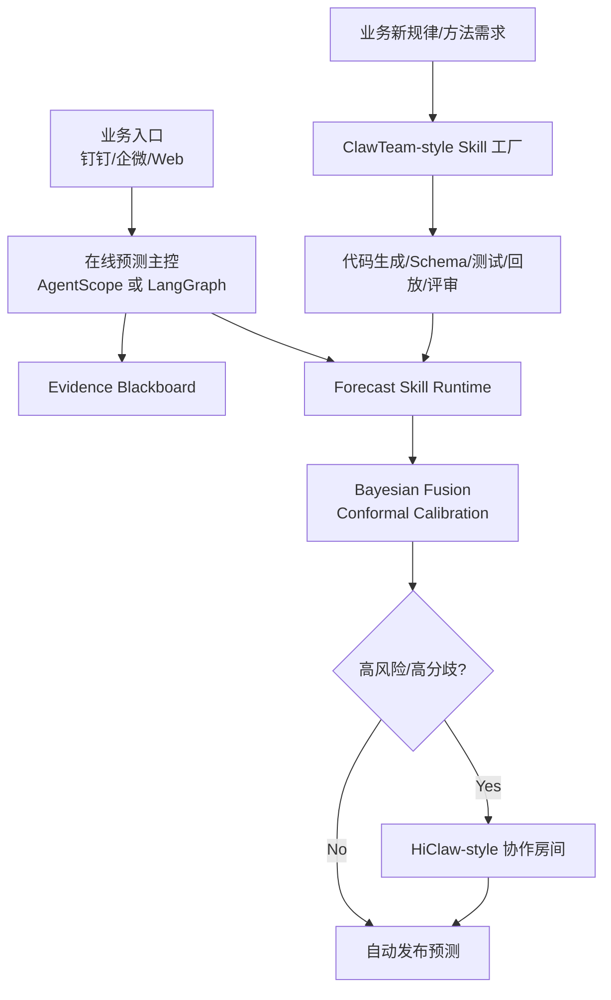
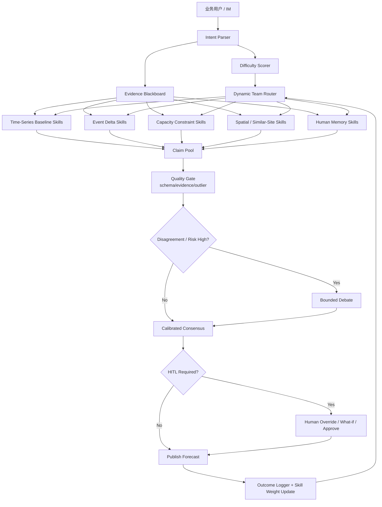
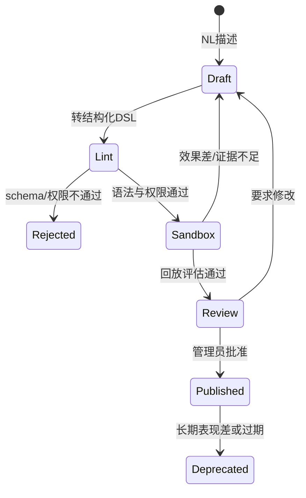
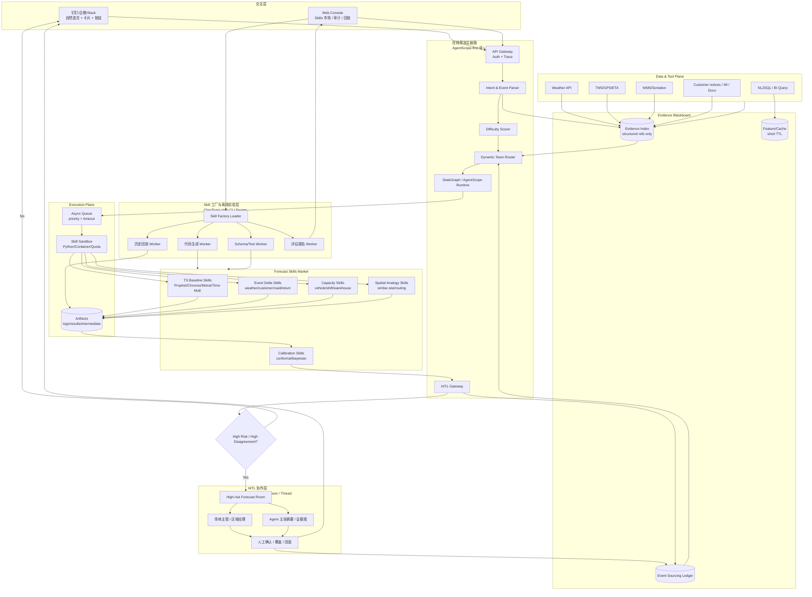

# 中转场地在线预测智能体集群技术白皮书

> 版本：v1.1  
> 日期：2026-06-02  
> 角色视角：首席 AI 科学家 × 物流供应链数字化转型专家 × 独立技术调研总监  
> 研究边界：本报告仅从本地 PRD 中抽取业务需求与产品功能背景，不继承其中既有技术路线；技术判断基于公开论文、官方文档、开源仓库与第一性原理推导。  
> v1.1 修订说明：补强 HiClaw、ClawTeam、AgentScope 的选型论证，将三者纳入明确分层架构，而非仅作为“可吸收设计”。

---

## 执行摘要

快递中转场地预测的真正难点不是 80% 平稳场景，而是 20% 小众、边缘、突发场景：局部暴雨、大客户临时出货、修路封路、倒货、临时交通管制、退货潮。这些场景具有三个共同特征：

1. **事件先于数据**：微信/钉钉群、天气预警、客户电话、调度通知先出现，结构化历史数据后出现。
2. **规律局部有效**：同一个事件在不同场地、班次、库区、流向上的影响幅度不同，不能用全网统一模型硬套。
3. **业务必须可覆盖**：场地主管在突发场景下要对人手、车位、流水线负责，因此需要可解释、可微调、可回滚的 AI。

本报告的结论是：**中转场地边缘预测不应采用纯去中心化 swarm，也不应采用静态 DAG。最佳架构是“证据黑板 + 难度感知动态团队 + 有界协商 + 统计校准 + 人类门禁 + 自适应 Skill 市场”的混合体。**

在工程选型上，本报告推荐采用**分层组合架构**，而不是单框架崇拜：

```text
在线预测主链路：AgentScope / LangGraph StateGraph 双候选
HITL 协作与审计：HiClaw-style room/thread
Skill 工厂与离线实验：ClawTeam-style CLI swarm
跨系统协议：MCP / A2A-inspired Skill Card
预测算法内核：时序基线 + 事件 Delta + Bayesian Fusion + Conformal Calibration
```

其中，AgentScope 不再只是“参考思想”，而是应进入核心主控候选；HiClaw 不作为全量预测 serving runtime，但应作为高风险任务的人机协同房间；ClawTeam 不作为在线预测主链路，但非常适合作为预测 Skill 自动开发、回测、参数搜索和模板评审的离线工厂。

推荐终版架构命名为：

> **L-Forecast Swarm：Logistics Forecasting Swarm with Evidence Blackboard and Difficulty-Aware Agent Teaming**

其核心公式：

```text
Final Forecast
= CalibratedConsensus(
    TimeSeriesBaseline,
    EventDeltaSkills,
    CapacityConstraintSkills,
    HumanOverrides,
    HistoricalSkillReliability
  )
```

---

# 第一章：全球前沿技术扫描与理论基石

## 1.1 Agent Swarm / Agent Team 的演进范式

2023-2026 年，多智能体技术从“让多个 LLM 聊天”快速演进为“可审计、可约束、可路由、可治理的生产编排系统”。公开框架与论文呈现出五条主线。

| 阶段 | 代表范式 | 核心机制 | 对物流预测的价值 | 主要风险 |
|---|---|---|---|---|
| 1. 多副本辩论 | Multi-Agent Debate | 多个智能体提出答案，互相质询，最终汇总 | 对边缘事件可暴露不同解释路径 | Token 成本高，可能出现从众 |
| 2. 角色团队 | Crew / GroupChat | 不同角色承担研究、计算、校验、汇总 | 适合把人工预测经验 Skill 化 | 容易变成角色表演，缺少硬约束 |
| 3. 状态机编排 | StateGraph / Flow | 显式节点、状态、条件边、回滚点 | 适合生产审计、HITL、异常处理 | 配置复杂，业务自主组装门槛高 |
| 4. 动态团队 | DyLAN / DAAO | 根据任务难度和表现动态选 Agent | 适合常规场景少 Agent、突发场景多 Agent | 需要历史评价数据 |
| 5. 协议互操作 | MCP / A2A / Agent Card | 工具、资源、Agent 能力以协议暴露 | 适合 Skills 市场与企业生态接入 | 安全、权限、工具污染风险高 |

结论：物流边缘预测的最佳方向不是“越多 Agent 越好”，而是**按任务难度动态付费、按风险动态协商、按证据动态授权**。

## 1.2 核心论文剖析

### 1.2.1 DyLAN：动态 Agent 团队优化

论文：[A Dynamic LLM-Powered Agent Network for Task-Oriented Agent Collaboration, arXiv:2310.02170](https://arxiv.org/abs/2310.02170)

DyLAN 提出两阶段范式：先做 Team Optimization，再做 Task Solving。其重要性不在于某个具体算法，而在于承认了一个事实：**多 Agent 不是固定组织结构，而是随任务变化的临时团队**。

面向物流预测，可抽象为：

```text
Given:
  task x = {site, horizon, dimension, events, data_quality, urgency}
  agents A = {a1...an}
  cost c_i, reliability r_i, capability vector q_i

Select team:
  T*(x) = argmax_T E[Utility(T, x)] - λ Cost(T) - γ Latency(T)
```

其中：

```text
Utility(T, x)
= α AccuracyGain(T, x)
+ β Explainability(T, x)
+ δ Robustness(T, x)
- η HumanBurden(T, x)
```

对中转场地预测的启发：

- 平峰日常预测不需要 8 个 Agent，2-3 个足够。
- 大客户临时包机、暴雨、倒货等事件应提升团队规模和异质性。
- 团队选择要看“场地画像 × 数据完整度 × 历史 Skill 表现”，而不是固定 DAG。

### 1.2.2 DAAO：难度感知编排

论文：[Difficulty-Aware Agent Orchestration in LLM-Powered Workflows, arXiv:2509.11079](https://arxiv.org/abs/2509.11079)

DAAO 的关键思想是：静态工作流会同时犯两类错误：简单任务过度处理、复杂任务处理不足。它提出根据输入难度动态调整工作流深度、算子选择、模型分配。

物流预测中的任务难度可定义为：

```text
D(x) =
  w1 * EventRarity(x)
+ w2 * DataMissingRate(x)
+ w3 * HistoricalVolatility(x)
+ w4 * BusinessImpact(x)
+ w5 * ModelDisagreement(x)
+ w6 * ColdStartScore(x)
```

调度策略：

```text
K_agents = clip(ceil(2 + 4 * D(x)), 2, 6)
DebateRounds = 0 if D < 0.35
             = 1 if 0.35 <= D < 0.70
             = 2 if D >= 0.70
HITL = True if D >= 0.60 or BusinessImpact high
```

这直接解决物流中的成本问题：**常规 80% 场景低成本自动化，边缘 20% 场景才启用更昂贵的集群推理。**

### 1.2.3 Multi-Agent Debate：辩论不是万能药

基础论文：[Improving Factuality and Reasoning in Language Models through Multiagent Debate, arXiv:2305.14325](https://arxiv.org/abs/2305.14325)  
控制研究：[Can LLM Agents Really Debate?, arXiv:2511.07784](https://arxiv.org/abs/2511.07784)

多智能体辩论的工程启发不是“让 Agent 多聊几轮”，而是三条更冷静的规则：

1. **多样性比人数重要**：5 个同构 Agent 不如 3 个互补 Agent。
2. **辩论深度要有上限**：超过 2-3 轮通常收益下降，成本上升。
3. **必须抵抗从众**：如果所有 Agent 只看最终数字，很容易被多数意见带偏。

因此物流场景中的协商协议应是“证据约束型协商”，不是开放聊天：

```json
{
  "round": 1,
  "agent_id": "WeatherImpactSkill",
  "claim_to_review": "TrendSkill predicts 920000",
  "allowed_actions": ["keep", "adjust_interval", "raise_risk", "request_human"],
  "must_reference": ["weather_alert", "historical_similar_days", "site_capacity"],
  "forbidden": ["unreferenced_guess", "freeform_roleplay"]
}
```

### 1.2.4 Mixture-of-Agents：分层聚合优于扁平投票

论文：[Mixture-of-Agents Enhances Large Language Model Capabilities, arXiv:2406.04692](https://arxiv.org/abs/2406.04692)

MoA 采用分层结构：上一层多个 Agent 输出成为下一层输入。抽象为：

```text
z_l^i = Agent_l^i(x, z_{l-1}^1, z_{l-1}^2, ..., z_{l-1}^m)
```

对物流预测的启发：

- 第一层：并行生成多种预测分布。
- 第二层：按证据、历史表现、业务约束校准。
- 第三层：生成业务可读解释与 HITL 操作建议。

但 MoA 不应原样照搬。原因是物流预测有明确的数值评价与时效约束，不能让层数无限堆叠。推荐采用**两层半结构**：

```text
Layer 0: 数据/事件证据黑板
Layer 1: 专家 Skill 并行预测
Layer 2: 校准与共识
Layer 2.5: HITL 门禁与解释生成
```

### 1.2.5 AgentScope：消息为中心的多 Agent 平台

论文：[AgentScope: A Flexible yet Robust Multi-Agent Platform, arXiv:2402.14034](https://arxiv.org/abs/2402.14034)  
官方文档：[AgentScope docs](https://docs.agentscope.io/)

AgentScope 的价值在于强调 Message Exchange 和可观察、可理解、可操控的 Agent 工程。官方文档还强调支持 MCP、A2A、agent skills、message hub、HITL、observability。

对本项目的启发：

- Skills 市场必须先定义消息协议，而不是先堆 UI。
- 每个 Skill 的输入、输出、证据引用、置信度、版本号必须机器可校验。
- Agent 编排平台要能复盘“谁在何时基于什么证据做了什么判断”。

### 1.2.6 时间序列基础模型：适合作为专家，不适合作为唯一大脑

关键论文与项目：

- [Chronos: Learning the Language of Time Series, arXiv:2403.07815](https://arxiv.org/abs/2403.07815)：将时间序列数值缩放、量化为 token，用语言模型架构建模。
- [Moirai / Unified Training of Universal Time Series Forecasting Transformers, arXiv:2402.02592](https://arxiv.org/abs/2402.02592)：通用时间序列 Transformer，支持多领域预训练。
- [Time-MoE, arXiv:2409.16040](https://arxiv.org/abs/2409.16040)：Mixture-of-Experts 时间序列基础模型，强调大规模泛化。
- [Time-LLM, arXiv:2310.01728](https://arxiv.org/abs/2310.01728)：通过 reprogramming 复用 LLM 进行时间序列预测。
- [Are Language Models Actually Useful for Time Series Forecasting?, arXiv:2406.16964](https://arxiv.org/abs/2406.16964)：提醒业界不要把 LLM4TS 当银弹。

结论：

```text
Time-series foundation model = strong baseline expert
LLM event reasoning = context interpreter
Skill Swarm = scenario-specific decision layer
Human = accountability owner and event truth source
```

对于中转场地，最稳妥的工程范式是：

```text
BaselineForecast(t) from TS model
+ EventDelta(t) from event Skills
+ CapacityAdjustment(t) from operational constraints
+ HumanOverride(t) when high risk
```

而不是让 LLM 直接“想一个件量数字”。

---

# 第二章：主流 Agent 集群框架/协议的无偏见深度横评

## 2.1 框架与协议扫描对象

本次扫描覆盖：

| 类别 | 对象 | 公开来源 |
|---|---|---|
| 状态机编排 | LangGraph | [LangGraph multi-agent docs](https://docs.langchain.com/oss/python/langchain/multi-agent) |
| 会话型多 Agent | AutoGen | [AutoGen GroupChat docs](https://autogenhub.github.io/autogen/docs/reference/agentchat/groupchat/) |
| 角色团队/流程 | CrewAI | [CrewAI Flows](https://www.crewai.com/crewai-flows) |
| 生产 Agent 平台 | AgentScope | [AgentScope docs](https://docs.agentscope.io/) |
| IM/HITL 协同 OS | HiClaw | [agentscope-ai/HiClaw](https://github.com/agentscope-ai/hiclaw) |
| CLI Swarm | ClawTeam | [web3-claw/ClawTeam](https://github.com/web3-claw/ClawTeam) |
| 工具互操作协议 | MCP | [MCP specification](https://modelcontextprotocol.io/specification/2025-03-26/basic/index) |
| Agent 互操作协议 | A2A | [Google A2A protocol specification](https://google-a2a.github.io/A2A/specification/) |
| SDK 级 guardrails | OpenAI Agents SDK | [Agents SDK tracing](https://openai.github.io/openai-agents-python/tracing/), [guardrails](https://openai.github.io/openai-agents-js/guides/guardrails) |

## 2.2 LangGraph

### 底层范式

LangGraph 的核心是 StateGraph：节点函数读取共享状态，返回状态增量；边定义流转；条件边定义分支。它天然适合生产系统中的：

- 显式状态；
- 条件流转；
- checkpoint；
- human-in-the-loop；
- 子图；
- 可观测事件流。

### 适合物流预测的原因

物流预测不是聊天应用，而是强流程系统：

```text
请求 → 取数 → 数据质量评估 → 选 Skill → 并行执行 → 协商 → 校准 → HITL → 发布
```

这类流程必须有状态机，而不是纯对话。

### 核心状态流转表

| State | 输入 | 输出 | 失败处理 |
|---|---|---|---|
| IntentParsed | IM 文本 | site/date/dimension/events | 追问用户 |
| EvidenceBuilt | 查询计划 | evidence blackboard | 缓存/降级 |
| TeamSelected | difficulty + registry | selected skills | fallback skill |
| ClaimsCollected | skill payloads | claims[] | timeout/outlier 标记 |
| ConsensusMade | claims[] | forecast distribution | debate/HITL |
| HumanChecked | forecast + risk | final decision | rollback |

### 通信报文建议

```json
{
  "type": "state_delta",
  "trace_id": "tr_20260602_001",
  "node": "ClaimsCollected",
  "writes": {
    "claims": [
      {
        "skill_id": "weather_delta_v2",
        "value_delta": -32000,
        "interval": [-55000, -12000],
        "evidence_refs": ["weather:alert:20260602-shanghai"],
        "confidence": 0.71
      }
    ]
  }
}
```

## 2.3 AutoGen

AutoGen 的传统强项是会话型多 Agent。其 GroupChat 数据结构包含 agents、messages、max_round、speaker selection 等，GroupChatManager 负责管理发言顺序。

### 优点

- 快速搭建多角色讨论；
- 支持 speaker selection；
- 支持函数调用过滤；
- 适合研究、方案生成、代码审查。

### 对物流预测的局限

- 如果预测主流程完全采用 GroupChat，审计边界容易变成“消息历史”，而非结构化状态。
- 对高并发数值预测而言，开放对话的 token 成本不可控。
- 更适合作为“协商引擎插件”，不适合作为整个系统主骨架。

### 推荐用法

```text
LangGraph 主控流程
  └── AutoGen-style Debate Subgraph
        ├── TrendSkill
        ├── EventSkill
        ├── CapacitySkill
        └── Judge/Calibrator
```

## 2.4 CrewAI

CrewAI 明确区分 Crews 与 Flows：Crews 偏自主协作，Flows 偏结构化事件驱动流程。其官方材料强调 Flows 可混合规则、函数、LLM 调用和 Crews。

### 优点

- 产品表达友好：角色、任务、流程直观；
- 业务人员容易理解；
- 适合知识工作流和轻量自动化。

### 局限

- 对复杂状态、回滚、可重复数值实验、严格审计的表达弱于显式 StateGraph。
- 如果用 role/task 作为核心抽象，容易让预测 Skill 变成“角色叙事”而不是可验证算法单元。

### 推荐用法

CrewAI 更适合作为 Skills Composer 的产品隐喻，而不是底层唯一执行引擎。

## 2.5 AgentScope

AgentScope 官方定位为可观察、可理解、可操控的生产级 Agent 框架，强调 Agent、工具、记忆、HITL、观测、MCP/A2A、message hub。

### 对本项目的启发

AgentScope 的 message hub 思路非常适合 Skills 市场：

```json
{
  "message_id": "msg_001",
  "from": "CustomerSurveySkill",
  "to": "Blackboard",
  "type": "skill.claim",
  "payload": {
    "target": "volume:T+1:site:021WD",
    "distribution": {"mean": 880000, "p10": 820000, "p90": 940000},
    "evidence": ["customer_call:DW:20260602"],
    "assumptions": ["customer self-report bias corrected by 0.82"]
  }
}
```

### 修订判断：AgentScope 应进入在线主控候选

AgentScope 不应只被视为“可吸收设计”。从生产 Agent 系统视角看，它覆盖了本项目在线主链路所需的多项底座能力：Agent 运行时、消息流、HITL、工具权限、观测、MCP/A2A 互操作、Agent Service 与 Studio 生态。这些能力与“预测 Skills 市场”的基础设施高度吻合。

但 AgentScope 不能单独解决物流预测的领域问题。它提供的是 Agent 工程底座，而不是物流预测算法内核。本项目仍需自研：

- Evidence Blackboard：统一结构化时序、事件文本、车辆 ETA、客户通知、人工备注；
- Forecast Skill Schema：约束 Skill 输入、输出、证据引用、置信区间；
- Bayesian Fusion：将基线预测、事件 Delta、容量约束融合为分布；
- Conformal Calibration：校准置信区间，防止 Agent 过度自信；
- Contextual Bandit：按场地、场景、维度更新 Skill 权重。

因此，AgentScope 的正确位置是：

```text
AgentScope = 在线 Agent Runtime / Event Stream / HITL / Tool Permission / Agent Service 候选底座
自研预测层 = Evidence Blackboard + Forecast Skill Schema + Fusion + Calibration + Weight Learning
```

与 LangGraph 的关系不是“二选一”，而是两种主控落地路径：

| 主控路径 | 适用条件 | 优点 | 风险 |
|---|---|---|---|
| AgentScope-first | 需要完整 Agent 平台能力、Studio、Agent Service、多租户服务化 | 平台完整，Agent 工程能力强，适合长期 Skills 市场 | 引入框架较重，需适配企业现有服务治理 |
| LangGraph-first | 已有 Python/FastAPI/数据服务体系，需要轻量显式状态机 | 简洁、可控、容易嵌入现有系统 | Agent 平台能力需自建更多 |

推荐结论：**PoC 阶段同时验证 AgentScope-first 与 LangGraph-first，两周内用同一套 Forecast Claim Schema 跑同一批回放任务，以状态可控性、HITL 成本、吞吐、审计便利性决定主控。**

## 2.6 HiClaw

HiClaw 公开仓库描述为 “Collaborative Multi-Agent OS”，强调通过 Matrix rooms 进行透明、人类可介入的任务协调。

### 适合点

- IM-native；
- 人类可旁观和介入；
- 强调透明协作；
- 对“业务人员在钉钉/企微里参与预测”有启发。

### 不适合点

- Matrix room 模式偏“人机团队协作”，不天然等价于高并发预测服务。
- 物流预测需要大量机器可验证的结构化 claim，不应把核心预测过程放在自由聊天房间里。

### 修订判断：HiClaw 应作为 HITL 协作层，而非全量 serving runtime

HiClaw 的核心价值是“把多 Agent 协作变成业务人员可见、可介入、可审计的协作空间”。这正好命中中转场地预测的信任鸿沟：场地主管不是只要一个数字，而是要知道谁提出了什么主张、依据是什么、自己能在哪里覆盖。

但 HiClaw 不适合作为所有预测任务的默认主链路：

- 80% 平稳场景应在后台低成本自动化完成，不应每次创建协作房间；
- 预测核心对象是机器可校验的 `ForecastClaim`，不是自由聊天消息；
- 高并发批量预测需要队列、限流、幂等、超时和结构化审计，而不是以 room 为唯一状态源；
- Matrix/room 模式非常适合“高风险任务人机协作”，但不应承载所有数值计算链路。

因此 HiClaw 的正确位置是：

```text
常规任务：在线主链路自动完成 → 钉钉卡片返回
高风险任务：主链路检测到高分歧/高影响/低证据 → 创建 HiClaw-style 协作房间
房间中：业务人员、区域经理、关键 Agent、证据摘要共同协作
确认后：回写 Event Ledger 与 Forecast Decision
```

推荐在产品上暴露为：

```text
“查看协作室” / “召集团队复核” / “让天气 Skill 与运力 Skill 对一下”
```

它不是替代主控，而是让高风险预测具备组织协同与责任闭环。

## 2.7 ClawTeam

ClawTeam 公开 README 呈现为 CLI Swarm：leader agent 可 `spawn` worker，worker 通过 task/inbox/board 协同，隔离机制包括 git worktree、tmux window、独立身份，适合工程类任务和大规模实验。

### 典型机制

```bash
clawteam spawn --team my-team \
  --agent-name worker1 \
  --task "Implement auth module"

clawteam inbox send my-team leader \
  "Auth done. All tests passing."
```

### 修订判断：ClawTeam 应作为 Skill 工厂与离线实验层

ClawTeam 不适合在线预测 serving，但它非常适合“预测 Skills 市场”的供给侧：自动开发、改造、测试、回放、参数搜索和评审 Skill。

在线预测主链路要求：

- API 化调用；
- 秒级/分钟级 SLA；
- 结构化状态；
- 幂等任务；
- 可审计执行；
- 稳定资源隔离。

而 ClawTeam 的优势在于：

- leader/worker 的任务分解；
- worker 隔离上下文；
- inbox/board 的异步协作；
- git worktree/tmux 适合代码生成与实验；
- 多 CLI Agent 并行跑回测和模板修复。

因此它最适合承担：

```text
ClawTeam = Skill Factory / Offline Experiment Swarm

典型任务：
1. 根据业务自然语言生成 Skill 草案；
2. 一个 worker 写 Python 模板；
3. 一个 worker 写 schema 与测试；
4. 一个 worker 跑历史回放；
5. 一个 worker 做误差分析；
6. leader 汇总成发布评审报告。
```

这能解决“业务发现新规律，IT 排期数周”的敏捷响应鸿沟，但不能替代生产预测 runtime。

## 2.8 MCP 与 A2A

MCP 官方规范采用 JSON-RPC 2.0，抽象 tools、resources、prompts。A2A 强调 Agent Card、JSON-RPC/HTTP/SSE、同步/异步/流式通信。

### 对 Skills 市场的意义

Skill 本质上是一个可发现、可调用、可验证的能力单元，因此建议兼容 MCP/A2A 风格元数据：

```json
{
  "skill_card": {
    "skill_id": "weather_delta_v2",
    "name": "暴雨影响修正",
    "capabilities": ["event_delta", "risk_interval"],
    "input_schema": "https://schema.company/forecast/skill-input-v1.json",
    "output_schema": "https://schema.company/forecast/claim-v1.json",
    "auth": {"scope": "forecast.event.weather"},
    "safety": {"requires_human_confirmation": true}
  }
}
```

### 安全提示

协议开放会引入工具污染、提示注入、权限扩散、供应链风险。预测 Skills 市场不能允许任意 Skill 直接访问生产数据或执行任意代码，必须通过：

- schema lint；
- sandbox；
- allowlist；
- reviewer approval；
- execution budget；
- evidence-only access；
- audit log。

## 2.9 量化对比矩阵

评分：1=弱，5=强。该评分针对“中转场地边缘预测”场景，而非通用 Agent 应用。

| 框架/协议 | 状态可控 | 动态团队 | HITL | 高并发预测 | 协议开放 | 审计 | 业务可理解 | 综合判断 |
|---|---:|---:|---:|---:|---:|---:|---:|---|
| LangGraph | 5 | 4 | 5 | 4 | 3 | 5 | 3 | 轻量 StateGraph 主控候选 |
| AutoGen | 3 | 4 | 3 | 2 | 3 | 3 | 4 | 协商子系统候选 |
| CrewAI | 3 | 3 | 3 | 3 | 3 | 3 | 5 | 产品隐喻好，底层需谨慎 |
| AgentScope | 4 | 4 | 4 | 4 | 5 | 4 | 4 | 平台型在线主控候选 |
| HiClaw | 3 | 4 | 5 | 2 | 3 | 4 | 5 | HITL 协作与审计房间首选 |
| ClawTeam | 2 | 5 | 4 | 2 | 2 | 4 | 4 | Skill 工厂与离线实验首选 |
| MCP | 2 | 2 | 2 | 4 | 5 | 3 | 2 | 工具/数据接入协议 |
| A2A | 2 | 4 | 3 | 4 | 5 | 3 | 3 | 跨 Agent 互操作协议 |

修订后的推荐不是单框架选择，而是分层组合：

```text
在线预测主控：AgentScope-first 或 LangGraph-first，二者进入 PoC 双候选
协商子系统：AutoGen-style bounded debate，必须受 ForecastClaim schema 约束
HITL 协作层：HiClaw-style room/thread，只在高风险/高分歧任务触发
Skill 工厂：ClawTeam-style CLI swarm，用于生成、回测、修复和评审 Skill
协议规范：MCP/A2A-inspired Skill Card + Forecast Claim Schema
预测算法层：自研 Evidence Blackboard + Bayesian Fusion + Conformal Calibration
```

分层职责图：



---

# 第三章：物流边缘预测场景的第一性原理架构推导

## 3.1 物流预测的特殊约束

| 约束 | 技术含义 | 架构影响 |
|---|---|---|
| 强时序性 | 日期、班次、库区、流向存在稳定周期和滞后关系 | 必须保留统计/时序模型作为基线 |
| 事件先行 | 事件文本先于结构化数据 | 需要事件理解 Skill 与证据黑板 |
| 低容错 | 偏差会影响人力、车位、流水线 | 必须有置信区间、HITL、回滚 |
| 高并发 | 50+ 试点、未来可到 1000+ 场地 | 不能全量 debate，必须难度感知 |
| 业务责任 | 主管要能覆盖结果 | 系统必须可解释、可调整、可审计 |
| 数据异构 | 时序、车辆、天气、客户文本、人工备注 | 需要统一 evidence schema |
| 场地差异 | 每个场地规律不同 | Skill 权重必须上下文自适应 |

## 3.2 目标函数

系统目标不是单纯最小化 MAPE，而是最小化业务损失：

```text
Minimize:
  L = λ1 * ForecastError
    + λ2 * UnderCapacityPenalty
    + λ3 * OverCapacityCost
    + λ4 * LatencyCost
    + λ5 * TokenCost
    + λ6 * HumanBurden
    + λ7 * UnexplainabilityRisk
```

其中：

```text
ForecastError = |y_hat - y_actual| / y_actual

UnderCapacityPenalty = max(0, y_actual - capacity_plan(y_hat)) * c_under
OverCapacityCost = max(0, capacity_plan(y_hat) - y_actual) * c_over

通常 c_under > c_over
```

这意味着：极端场景下，系统应偏向输出更宽的区间和更保守的人工门禁，而不是追求漂亮的点预测。

## 3.3 为什么不选纯去中心化 Swarm

纯 P2P Swarm 的优势是灵活，但物流预测有四个硬约束：

1. 预测结果需要可审计；
2. HITL 必须有明确责任点；
3. 高频任务需要成本可控；
4. 数值预测需要统一校准。

纯去中心化会导致：

```text
No central state → evidence version 不一致
No bounded protocol → debate 成本不可控
No deterministic checkpoint → 事故复盘困难
No unified calibration → 各 Agent 置信度不可比较
```

因此不推荐。

## 3.4 为什么不选静态 DAG

静态 DAG 的问题相反：可靠但僵硬。

```text
大客户包机 + 局部暴雨 + 修路封路 + 临时倒货
```

这种组合事件不可能提前穷举成固定流程。静态 DAG 会导致：

- 新规律上线慢；
- 业务自主组装困难；
- 小众场景必须排期开发；
- 边缘场景复用差。

因此也不推荐。

## 3.5 推荐拓扑：证据黑板 + 动态团队 + 有界协商



## 3.6 Skills 市场元数据模型

### Skill Card YAML

```yaml
apiVersion: forecast.company/v1
kind: ForecastSkill
metadata:
  skill_id: weather_delta_v2
  name: 暴雨影响修正 Skill
  owner: logistics-ai-lab
  version: 2.1.0
  status: published
  tags: [event, weather, delta, risk_interval]

capability:
  forecast_target:
    - arrival_volume
  horizon:
    min_hours: 4
    max_days: 3
  dimensions:
    - site_total
    - shift
    - upstream_flow
  output_type: distribution_delta

inputs:
  required:
    - site_code
    - target_date
    - baseline_forecast
    - weather_alert_text
    - historical_similar_days
  optional:
    - vehicle_eta
    - road_closure_text
    - human_notes

execution:
  runtime: python_sandbox
  entrypoint: skills/weather_delta_v2/main.py
  timeout_seconds: 30
  max_memory_mb: 512
  network: denied

safety:
  pii_access: false
  requires_human_confirmation_when:
    - abs(delta_ratio) > 0.08
    - evidence_quality < 0.60
  allowed_data_scopes:
    - weather_public
    - site_history_aggregated

evaluation:
  primary_metric: weighted_mape
  calibration_metric: interval_coverage
  min_sample_for_auto_weight: 30
```

### Skill Claim JSON

```json
{
  "schema_version": "forecast.claim.v1",
  "trace_id": "tr_20260602_001",
  "skill_id": "weather_delta_v2",
  "skill_version": "2.1.0",
  "target": {
    "site_code": "021WD",
    "target_date": "2026-06-03",
    "dimension": "site_total",
    "horizon": "T+1"
  },
  "claim": {
    "type": "delta_distribution",
    "mean_delta": -32000,
    "p10_delta": -56000,
    "p90_delta": -9000,
    "confidence": 0.71
  },
  "evidence_refs": [
    "weather_alert:shanghai:20260602:orange_rainstorm",
    "historical_analogue:021WD:20240519"
  ],
  "assumptions": [
    "暴雨影响主要延迟晚班到车，不直接减少全天总量",
    "历史相似日样本数为 7，证据强度中等"
  ],
  "risk_flags": [
    "road_closure_data_missing",
    "high_shift_transfer_risk"
  ],
  "execution": {
    "duration_ms": 1832,
    "sandbox_id": "sbx_001",
    "artifact_uri": "artifact://tr_20260602_001/weather_delta_v2/result.json"
  }
}
```

## 3.7 自然语言注册 Skill 的治理流程

业务人员说：

```text
以后遇到“客户临时包机”，先按客户上报量的 0.85 计入大客户集货，
再看上游车辆 ETA，如果 22 点后集中到，就把 30% 转到夜班。
```

系统不应直接发布为生产 Skill，而应进入四阶段：

```text
Draft → Lint → Sandbox Backtest → Review → Published
```



---

# 第四章：终版行业解决方案设计

## 4.1 终版系统架构图



架构含义：

| 层级 | 推荐框架/模式 | 职责边界 |
|---|---|---|
| 在线预测主链路 | AgentScope-first 或 LangGraph-first | 承载状态机、动态团队、并行执行、HITL 网关、审计追踪 |
| HITL 协作层 | HiClaw-style room/thread | 只在高风险、高分歧、低证据任务触发，承载业务人员可见协作与覆盖 |
| Skill 工厂 | ClawTeam-style CLI swarm | 离线生成、测试、回放、评审和修复 Skill，不进入在线 serving 主链路 |
| 协议层 | MCP/A2A-inspired Skill Card | 统一 Skill 发现、调用、权限、输入输出 schema |
| 预测算法层 | 自研 | Evidence Blackboard、Bayesian Fusion、Conformal Calibration、Bandit 权重 |

## 4.2 宏观趋势与微观事件融合算法

### 4.2.1 预测对象

对每个场地、日期、维度输出一个分布：

```text
Y_{s,t,d} ~ P(y | history, events, capacity, human_memory)
```

基础分解：

```text
Y = B + Σ Δ_event + Σ Δ_capacity + Δ_spatial + ε
```

其中：

- `B`：时序基线；
- `Δ_event`：非结构化事件冲击；
- `Δ_capacity`：车辆、库区、班次约束；
- `Δ_spatial`：路由变更、相邻场地溢出；
- `ε`：残差。

### 4.2.2 Bayesian Delta Fusion

每个 Skill 输出分布：

```text
Claim_i = Normal(μ_i, σ_i^2)
```

历史可靠性给出权重：

```text
r_i = exp(-MAPE_i / τ) * coverage_i * evidence_quality_i
```

融合：

```text
Precision_i = r_i / σ_i^2

μ_fused = Σ(Precision_i * μ_i) / Σ Precision_i
σ_fused^2 = 1 / Σ Precision_i + σ_residual^2
```

点预测：

```text
y_hat = μ_baseline + μ_fused_delta
```

区间：

```text
PI_80 = [y_hat - 1.28 * σ_total, y_hat + 1.28 * σ_total]
```

### 4.2.3 Conformal Calibration

为了避免模型置信度虚高，用历史残差做校准：

```text
residual_t = |y_t - y_hat_t|
q = Quantile(residuals, 1 - α)
PI_conformal = [y_hat - q, y_hat + q]
```

对大促、暴雨、倒货等事件，需要按 scenario bucket 分桶校准：

```text
bucket = hash(site_type, event_type, horizon, dimension)
q_bucket = Quantile(residuals[bucket], 1 - α)
```

## 4.3 多 Agent 分歧检测机制

分歧不能只看标准差，应同时考虑区间重叠、证据冲突和业务影响。

```text
Disagreement =
  a * CoefVar(point_predictions)
+ b * (1 - AvgIntervalOverlap)
+ c * EvidenceConflictRate
+ d * RankInstability
+ e * BusinessImpact
```

触发规则：

| 条件 | 动作 |
|---|---|
| Disagreement < 0.25 | 直接校准融合 |
| 0.25 ≤ Disagreement < 0.55 | 触发 1 轮证据协商 |
| Disagreement ≥ 0.55 | 触发 2 轮协商 + HITL |
| 任一高影响事件缺证据 | HITL |
| 任一 Skill 离群但证据强 | 保留并提升解释优先级 |

## 4.4 Python 伪代码：端到端调度

```python
def forecast(request: ForecastRequest) -> ForecastResponse:
    trace = new_trace(request)

    intent = parse_intent(request.text, user=request.user)
    evidence = build_blackboard(intent, trace)
    difficulty = score_difficulty(intent, evidence)

    team = select_team(
        intent=intent,
        evidence=evidence,
        difficulty=difficulty,
        registry=skill_registry,
        reliability=skill_reliability_store,
    )

    claims = run_skills_parallel(
        team=team,
        evidence=evidence,
        timeout=budget_for(difficulty),
        trace=trace,
    )

    claims = quality_gate(claims)
    disagreement = calc_disagreement(claims, intent)

    if disagreement.requires_debate:
        claims = bounded_debate(
            claims=claims,
            evidence=evidence,
            max_rounds=debate_rounds(difficulty),
            trace=trace,
        )

    fused = bayesian_fusion(claims)
    calibrated = conformal_calibrate(
        fused=fused,
        bucket=scenario_bucket(intent, evidence),
    )

    hitl_decision = hitl_gate(
        forecast=calibrated,
        disagreement=disagreement,
        business_impact=estimate_business_impact(intent),
    )

    if hitl_decision.required:
        return send_to_human(calibrated, claims, evidence, trace)

    publish_forecast(calibrated, trace)
    return build_response(calibrated, claims, trace)
```

## 4.5 LangGraph 状态图定义示例

```python
from typing import TypedDict, List
from langgraph.graph import StateGraph, START, END

class ForecastState(TypedDict):
    trace_id: str
    request: dict
    intent: dict
    evidence: dict
    difficulty: float
    selected_skills: List[dict]
    claims: List[dict]
    disagreement: dict
    forecast: dict
    hitl: dict

graph = StateGraph(ForecastState)

graph.add_node("parse_intent", parse_intent_node)
graph.add_node("build_evidence", build_evidence_node)
graph.add_node("score_difficulty", score_difficulty_node)
graph.add_node("select_team", select_team_node)
graph.add_node("run_skills", run_skills_parallel_node)
graph.add_node("quality_gate", quality_gate_node)
graph.add_node("debate", bounded_debate_node)
graph.add_node("fuse", bayesian_fusion_node)
graph.add_node("calibrate", conformal_calibration_node)
graph.add_node("hitl_gate", hitl_gate_node)
graph.add_node("publish", publish_node)
graph.add_node("human_review", human_review_node)

graph.add_edge(START, "parse_intent")
graph.add_edge("parse_intent", "build_evidence")
graph.add_edge("build_evidence", "score_difficulty")
graph.add_edge("score_difficulty", "select_team")
graph.add_edge("select_team", "run_skills")
graph.add_edge("run_skills", "quality_gate")

graph.add_conditional_edges(
    "quality_gate",
    lambda s: "debate" if s["disagreement"]["requires_debate"] else "fuse",
    {"debate": "debate", "fuse": "fuse"},
)
graph.add_edge("debate", "fuse")
graph.add_edge("fuse", "calibrate")
graph.add_edge("calibrate", "hitl_gate")
graph.add_conditional_edges(
    "hitl_gate",
    lambda s: "human_review" if s["hitl"]["required"] else "publish",
    {"human_review": "human_review", "publish": "publish"},
)
graph.add_edge("human_review", "publish")
graph.add_edge("publish", END)

forecast_graph = graph.compile()
```

## 4.6 Agent 间 Prompt/Message 协议

### Skill 执行请求

```json
{
  "message_type": "skill.execute.request",
  "trace_id": "tr_20260602_001",
  "skill_id": "customer_airfreight_delta_v1",
  "task": {
    "site_code": "021WD",
    "target_date": "2026-06-03",
    "dimension": "shift",
    "forecast_target": "arrival_volume"
  },
  "evidence_refs": [
    "im_notice:customer:dewu:20260602",
    "history:customer:dewu:last_30_days",
    "eta:vehicles:20260603"
  ],
  "constraints": {
    "must_return_schema": "forecast.claim.v1",
    "no_unreferenced_assumption": true,
    "max_runtime_seconds": 30
  }
}
```

### Debate 请求

```json
{
  "message_type": "debate.review.request",
  "trace_id": "tr_20260602_001",
  "round": 1,
  "reviewer_skill_id": "capacity_constraint_v3",
  "claims_to_review": [
    "claim_trend_001",
    "claim_weather_001",
    "claim_customer_001"
  ],
  "question": "这些主张是否违反夜班卸车能力和 ETA 到车窗口？",
  "allowed_response": {
    "enum": ["support", "challenge", "adjust_interval", "request_human"]
  }
}
```

### Debate 响应

```json
{
  "message_type": "debate.review.response",
  "trace_id": "tr_20260602_001",
  "round": 1,
  "reviewer_skill_id": "capacity_constraint_v3",
  "verdict": "adjust_interval",
  "target_claim": "claim_customer_001",
  "adjustment": {
    "reason": "22点后 ETA 集中，夜班吞吐上限不足，30% 件量可能跨班",
    "mean_delta_shift": {
      "day_shift": -18000,
      "night_shift": 18000
    }
  },
  "evidence_refs": [
    "eta:vehicles:20260603",
    "capacity:021WD:night_shift"
  ]
}
```

---

# 第五章：HITL 与自进化闭环设计

## 5.1 IM 中的一键覆盖与微调

### IM 卡片字段

```json
{
  "site": "021WD",
  "target_date": "2026-06-03",
  "main_forecast": 918000,
  "p80_interval": [872000, 962000],
  "risk_level": "high",
  "top_reasons": [
    "暴雨橙色预警，晚班 ETA 延迟风险高",
    "得物客户临时直播出货，客户上报可信度中等",
    "多 Agent 分歧指数 0.41"
  ],
  "actions": [
    "确认采用",
    "上调",
    "下调",
    "按事件重算",
    "查看证据",
    "回滚上版"
  ]
}
```

### 指令解析

| 用户指令 | 结构化动作 |
|---|---|
| “确认采用” | `approve_forecast` |
| “上调 2 万，原因：客户临时包机” | `override(delta=20000, reason=...)` |
| “把夜班加 3 万，白班不变” | `override_dimension(dimension=shift)` |
| “按去年台风天重算” | `what_if(add_evidence=historical_analogue)` |
| “回滚到 18 点版本” | `rollback(version=18:00)` |

### Event Sourcing

所有人工动作写入事件账本：

```json
{
  "event_id": "evt_001",
  "trace_id": "tr_20260602_001",
  "type": "human.override",
  "actor": "site_manager_021WD",
  "before": {"forecast": 918000},
  "after": {"forecast": 938000},
  "reason": "客户临时包机，已电话确认",
  "evidence_attachment": "im_screenshot://...",
  "timestamp": "2026-06-02T18:21:00+08:00"
}
```

回滚不是删除数据，而是追加补偿事件：

```json
{
  "type": "human.rollback",
  "rollback_to_event_id": "evt_000",
  "reason": "客户取消包机"
}
```

## 5.2 Skill 权重自适应：Contextual Bandit

### 奖励函数

```text
reward_i =
  - w1 * MAPE_i
  - w2 * CalibrationError_i
  - w3 * HumanAdjustmentRate_i
  - w4 * LatencyPenalty_i
  + w5 * AdoptionBonus_i
```

其中：

```text
HumanAdjustmentRate = |final_forecast - skill_claim| / final_forecast
```

### Contextual Thompson Sampling

每个 Skill 在每个场景 bucket 下维护后验：

```text
θ_i,b ~ Normal(μ_i,b, σ_i,b^2)
```

上线选择时抽样：

```text
sample_score_i = θ_i,b + exploration_bonus_i
```

更新：

```text
μ_new = (σ_obs^2 * μ_old + σ_old^2 * reward) / (σ_old^2 + σ_obs^2)
σ_new^2 = (σ_old^2 * σ_obs^2) / (σ_old^2 + σ_obs^2)
```

加入时间衰减：

```text
μ_t = decay * μ_{t-1} + (1 - decay) * reward_t
```

### 伪代码

```python
def update_skill_weight(skill_id, bucket, prediction, final, actual, latency_ms, adopted):
    mape = abs(prediction.mean - actual) / max(actual, 1)
    calibration_error = interval_miss_penalty(prediction.interval, actual)
    adjustment_rate = abs(final - prediction.mean) / max(final, 1)
    latency_penalty = max(0, latency_ms - 30000) / 30000

    reward = (
        -1.0 * mape
        -0.4 * calibration_error
        -0.3 * adjustment_rate
        -0.1 * latency_penalty
        +0.2 * int(adopted)
    )

    posterior = load_posterior(skill_id, bucket)
    posterior.mu = 0.92 * posterior.mu + 0.08 * reward
    posterior.sigma = max(0.05, posterior.sigma * 0.98)
    posterior.n += 1
    save_posterior(skill_id, bucket, posterior)
```

## 5.3 Skill 生命周期治理

| 状态 | 进入条件 | 权限 | 退出条件 |
|---|---|---|---|
| Draft | 自然语言生成或管理员创建 | 仅创建者可见 | lint 通过 |
| Sandbox | schema/权限通过 | 可回放，不可生产 | 回放指标达标 |
| Review | 回放通过 | 管理员/专家评审 | 批准发布 |
| Published | 审批通过 | 可被 Router 选择 | 表现衰退或下线 |
| Deprecated | 长期表现差/过期 | 不再新选用 | 可归档 |

---

# 第六章：演进路线与参考文献库

## 6.1 四阶段 Roadmap

| 阶段 | 时间 | 目标 | 技术交付 | 业务验证 |
|---|---:|---|---|---|
| Phase 0：研究与口径冻结 | 2-3 周 | 冻结数据口径、事件字典、Skill Claim Schema，并完成 AgentScope-first vs LangGraph-first 双候选 PoC | Evidence schema、Skill Card、最小回放集、主控框架 PoC 报告 | 8 个调研场地口径确认；同一批回放任务对比吞吐、HITL、审计成本 |
| Phase 1：MVP 单场景 | 4-6 周 | 钉钉触发、取数、2-3 个 Skill、主值返回 | 选定主控 runtime、Sandbox、基础融合、HITL Gateway | 2 个场地连续 14 天试运行 |
| Phase 2：Skills 市场与 Skill 工厂 | 8-10 周 | 业务可注册/组装/回放 Skill，ClawTeam-style 离线工厂支撑 Skill 生成与评审 | Skill Registry、Composer、Backtest、Review、Skill Factory Swarm | 10+ Skills、5 类事件覆盖；自动生成 Skill 必须通过回放评审 |
| Phase 3：动态团队、HiClaw HITL 与自进化 | 10-12 周 | 难度感知团队、协商、自适应权重，高风险任务进入 HiClaw-style 协作房间 | DAAO Router、bounded debate、HiClaw room/thread、bandit 更新 | 高风险场景 MAPE 与人工调整率下降；协作房间可审计 |
| Phase 4：商业化平台 | 12 周+ | 多区域、多租户、SLA、开放协议 | A2A/MCP gateway、审计合规、模型市场、跨区域方法社区 | 50+ 场地推广，形成方法论社区 |

## 6.2 推荐技术选型

| 层级 | 推荐 | 理由 |
|---|---|---|
| 在线预测主控 | AgentScope-first / LangGraph-first 双候选，PoC 后二选一或组合 | AgentScope 平台能力完整；LangGraph 轻量可控。二者均需接入统一 ForecastClaim Schema |
| 协商子系统 | AutoGen-style bounded debate | 适合多 Agent 质询，但必须有 schema 约束 |
| HITL 协作层 | HiClaw-style room/thread | 高风险任务可被业务人员旁观、介入、覆盖、回滚，解决信任与责任闭环 |
| Skill 工厂 | ClawTeam-style CLI swarm | 适合离线生成、测试、回放、参数搜索和评审 Skill，提升边缘场景响应速度 |
| Skill 协议 | MCP/A2A-inspired Skill Card | 可发现、可治理、可互操作 |
| 沙箱隔离 | Container/Python sandbox + quota | 防止业务自定义 Skill 失控 |
| 时间序列专家 | Prophet/Chronos/Moirai/Time-MoE 作为 baseline skills | 强时序基线，避免 LLM 乱给数字 |
| 自进化 | Contextual Bandit + Conformal Calibration | 兼顾探索、稳定和置信区间可靠性 |

## 6.3 参考文献与链接

### 多智能体论文

1. DyLAN: [A Dynamic LLM-Powered Agent Network for Task-Oriented Agent Collaboration, arXiv:2310.02170](https://arxiv.org/abs/2310.02170)
2. DAAO: [Difficulty-Aware Agent Orchestration in LLM-Powered Workflows, arXiv:2509.11079](https://arxiv.org/abs/2509.11079)
3. Multi-Agent Debate: [Improving Factuality and Reasoning in Language Models through Multiagent Debate, arXiv:2305.14325](https://arxiv.org/abs/2305.14325)
4. Controlled MAD Study: [Can LLM Agents Really Debate?, arXiv:2511.07784](https://arxiv.org/abs/2511.07784)
5. Mixture-of-Agents: [Mixture-of-Agents Enhances Large Language Model Capabilities, arXiv:2406.04692](https://arxiv.org/abs/2406.04692)
6. AgentScope: [AgentScope: A Flexible yet Robust Multi-Agent Platform, arXiv:2402.14034](https://arxiv.org/abs/2402.14034)
7. Large-scale AgentScope simulation: [Very Large-Scale Multi-Agent Simulation in AgentScope, arXiv:2407.17789](https://arxiv.org/abs/2407.17789)

### 时间序列与事件预测

1. Chronos: [Learning the Language of Time Series, arXiv:2403.07815](https://arxiv.org/abs/2403.07815)
2. Moirai: [Unified Training of Universal Time Series Forecasting Transformers, arXiv:2402.02592](https://arxiv.org/abs/2402.02592)
3. Time-MoE: [Billion-Scale Time Series Foundation Models with Mixture of Experts, arXiv:2409.16040](https://arxiv.org/abs/2409.16040)
4. Time-LLM: [Time Series Forecasting by Reprogramming Large Language Models, arXiv:2310.01728](https://arxiv.org/abs/2310.01728)
5. Critical view: [Are Language Models Actually Useful for Time Series Forecasting?, arXiv:2406.16964](https://arxiv.org/abs/2406.16964)

### 框架与协议

1. LangGraph multi-agent docs: <https://docs.langchain.com/oss/python/langchain/multi-agent>
2. AutoGen GroupChat docs: <https://autogenhub.github.io/autogen/docs/reference/agentchat/groupchat/>
3. CrewAI Flows: <https://www.crewai.com/crewai-flows>
4. AgentScope docs: <https://docs.agentscope.io/>
5. AgentScope website: <https://www.agentscope.io/>
6. HiClaw GitHub: <https://github.com/agentscope-ai/hiclaw>
7. ClawTeam GitHub: <https://github.com/web3-claw/ClawTeam>
8. MCP specification: <https://modelcontextprotocol.io/specification/2025-03-26/basic/index>
9. MCP tools specification: <https://modelcontextprotocol.io/specification/2025-06-18/server/tools>
10. A2A protocol specification: <https://google-a2a.github.io/A2A/specification/>
11. OpenAI Agents SDK tracing: <https://openai.github.io/openai-agents-python/tracing/>
12. OpenAI Agents SDK guardrails: <https://openai.github.io/openai-agents-js/guides/guardrails>

---

## 最终判断

中转场地边缘预测的技术路线，应避免两个极端：

- 不要把所有问题交给单一时序模型，因为边缘事件来自结构化数据之外；
- 不要把所有问题交给自由多 Agent 聊天，因为数值预测需要可校准、可审计、可回滚。

最佳路线不是“选一个框架包打天下”，而是把不同框架放在它们最擅长的位置：

```text
AgentScope / LangGraph 负责在线预测主控；
HiClaw 负责高风险任务的人机协同房间；
ClawTeam 负责离线 Skill 工厂与实验 swarm；
MCP / A2A 负责 Skill 能力描述与跨系统互操作；
时序模型负责稳定规律；
事件 Skill 负责突发上下文；
动态团队负责按难度扩缩容；
证据黑板负责统一事实来源；
有界协商负责处理分歧；
统计校准负责区间可靠；
HITL 负责业务责任闭环；
Bandit 负责越用越懂场地。
```

因此，本报告的最终选型修订为：

| 层级 | 最终建议 |
|---|---|
| 在线预测主链路 | **AgentScope-first 与 LangGraph-first 双候选 PoC**，用同一套 ForecastClaim Schema 比较后决策 |
| 高风险 HITL | **HiClaw-style 协作房间**，只在高分歧、高影响、低证据场景触发 |
| Skill 供给侧 | **ClawTeam-style Skill 工厂**，用于自然语言生成 Skill、代码/测试/回放/评审 |
| 领域核心 | 自研 Evidence Blackboard、Bayesian Fusion、Conformal Calibration、Contextual Bandit |

这才是面向物流边缘预测的 Agent Swarm：不是把通用 Agent 框架换个名字套进业务，而是把通用框架拆到正确层级，再用物流预测的证据、统计、审计和业务责任机制把它们组织起来。
